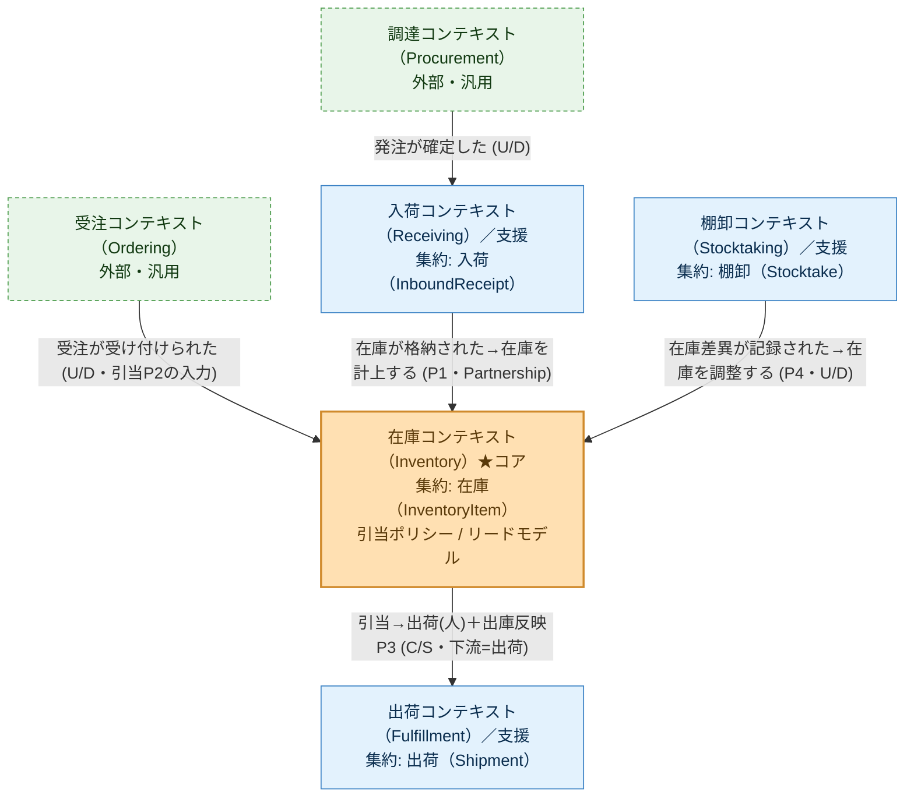

# コンテキストマップ（倉庫在庫管理）

> 由来: [`event-storming/03-software-design.md`](event-storming/03-software-design.md)。
> BC 間の関係と統合様式（イベント／ポリシー）を示す。**BC をまたぐ直接依存は作らず、
> 連携はドメインイベント＋ポリシー（結果整合）で行う**。

## 図

凡例: **U/D** = Upstream/Downstream（上流→下流）、**C/S** = Customer/Supplier、**P1〜P4** = [`02-process.md`](event-storming/02-process.md) のポリシー。

## 関係の詳細

| 上流 → 下流 | 様式 | 統合手段 | 備考 |
|---|---|---|---|
| 調達（Procurement） → 入荷（Receiving） | Upstream/Downstream（外部） | 外部トリガ「発注が確定した」 | 内製しない。薄く受ける |
| 受注（Ordering） → 在庫（Inventory） | Upstream/Downstream（外部） | 外部イベント「受注が受け付けられた」→ 引当ポリシー P2 | 本PoCのコア入力。上流は薄い外部トリガ |
| 入荷（Receiving） → 在庫（Inventory） | **Partnership**（同一倉庫チーム） | ポリシー P1（在庫が格納された→在庫を計上する） | 格納で在庫をコアへ供給。2集約またぎの結果整合 |
| 在庫（Inventory） → 出荷（Fulfillment） | Customer/Supplier（出荷=下流） | 出荷は👤アクター駆動（ピッキング/出荷）＋ポリシー P3 で在庫へ出庫反映（H7） | 引当を消化して出荷 |
| 棚卸（Stocktaking） → 在庫（Inventory） | Upstream/Downstream | ポリシー P4（在庫差異が記録された→在庫を調整する） | 実地差異を補正イベントで反映 |

## サブドメイン分類（投資配分の指針）
- **コア**: 在庫（Inventory）＝在庫引当。設計・テスト・レビューの投資を集中。
- **支援**: 入荷（Receiving）/ 出荷（Fulfillment）/ 棚卸（Stocktaking）。素直に実装。
- **汎用/外部**: 受注（Ordering）/ 調達（Procurement）。外部トリガとして最小限（内製しない）。

## 原則（ステアリング準拠）
- BC をまたぐ直接依存を作らない（[`.claude/rules/ddd-ubiquitous-language.md`](../.claude/rules/ddd-ubiquitous-language.md)）。
- 1トランザクション1集約。またぎは必ずイベント＋ポリシーで結果整合（[`.claude/rules/aggregate-design.md`](../.claude/rules/aggregate-design.md)）。
