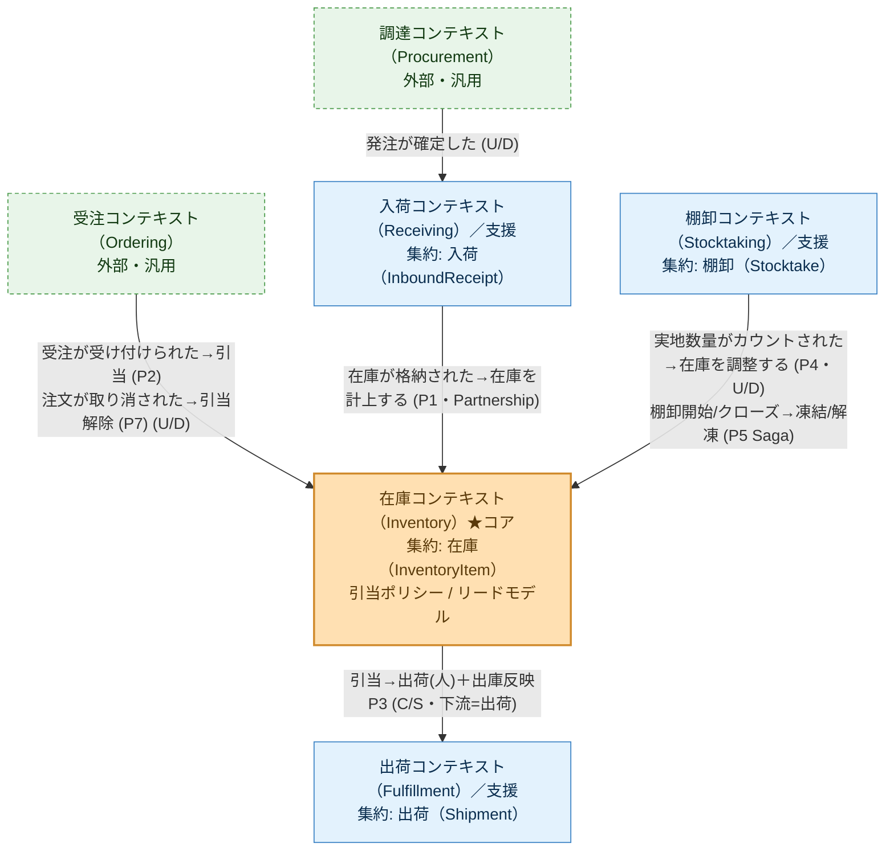

# コンテキストマップ（倉庫在庫管理）

> 由来: [`event-storming/03-software-design.md`](event-storming/03-software-design.md)。
> BC 間の関係と統合様式（イベント／ポリシー）を示す。**BC をまたぐ直接依存は作らず、
> 連携はドメインイベント＋ポリシー（結果整合）で行う**。

## 図

凡例: **U/D** = Upstream/Downstream（上流→下流）、**C/S** = Customer/Supplier、**P1〜P7** = ポリシー
（顔ぶれの正は [`ubiquitous-language.md`](ubiquitous-language.md)。P1〜P5 の導出は [`02-process.md`](event-storming/02-process.md)、
P6 は [H17](decisions.md#h17-宙に浮いた引当を誰が解放するか)、P7 は [H46](decisions.md#h46-出荷指示前に注文が取り消されたときの引当解放) で追加）。

## 関係の詳細

| 上流 → 下流 | 様式 | 統合手段 | 備考 |
|---|---|---|---|
| 調達（Procurement） → 入荷（Receiving） | Upstream/Downstream（外部） | 外部トリガ「発注が確定した」 | 内製しない。薄く受ける |
| 受注（Ordering） → 在庫（Inventory） | Upstream/Downstream（外部） | 外部イベント「受注が受け付けられた」→ 引当ポリシー P2 ／「注文が取り消された」→ 注文取消解放ポリシー **P7** | 本PoCのコア入力。上流は薄い外部トリガ。**引当は受注成立後の倉庫作業**であり、受注可否を在庫で判断する仕組み（**受注可能量**／ATP）ではない（[H24](decisions.md#h24-引当は受注の前か後か)）。**P2 と P7 が対**——どちらも引当ビューを読む（[H46](decisions.md#h46-出荷指示前に注文が取り消されたときの引当解放)） |
| 入荷（Receiving） → 在庫（Inventory） | **Partnership**（同一倉庫チーム） | ポリシー P1（在庫が格納された→在庫を計上する） | 格納で在庫をコアへ供給。2集約またぎの結果整合 |
| 在庫（Inventory） → 出荷（Fulfillment） | Customer/Supplier（出荷=下流） | 出荷は👤アクター駆動（ピッキング/出荷）＋ポリシー P3（在庫がピッキングされた→在庫を払い出す）＋ポリシー **P6**（欠品出荷・出荷取消→残った引当を解除する） | 引当を消化して出荷。消化されなかった引当は P6 が在庫へ返す（[H17](decisions.md#h17-宙に浮いた引当を誰が解放するか)）。P6 は BC 間の語彙も写像する（`SHORTAGE` → `SHORT_SHIPPED`） |
| 棚卸（Stocktaking） → 在庫（Inventory） | Upstream/Downstream | ポリシー P4（実地数量がカウントされた→在庫を調整する）＋ **サーガ P5**（棚卸開始→凍結／クローズ→解凍） | 棚卸は**実情の把握とレポート**に徹し差異を持たない。実地値を渡し、差分は在庫集約が出す（H10）。P5 は複数の在庫集約にまたがる唯一の Saga |

## 共有カーネル（Shared Kernel）

**共通の値オブジェクト**（`Sku` / `Quantity` / `QuantityDelta` / `LocationId` / `OrderLineId`）は、
BC ごとに重複定義せず**全 BC で共有する1組**として持つ（[H39](decisions.md#h39-warehouse-domain-のパッケージ配置)）。
実装上は `warehouse-domain` の `shared` パッケージ。顔ぶれの正は
[`tactical-design.md`](tactical-design.md) の「共有カーネル（`shared`）」。

- 下の原則「BC をまたぐ直接依存を作らない」の**唯一の例外**にあたるため、ここに明示する。
  依存の向きは各 BC → 共有カーネルの一方向で、BC どうしが直接つながるわけではない。
- **集約固有の識別子は共有しない**（[H43](decisions.md#h43-bc-をまたぐ識別子の帰属)）。
  複合識別子（`InventoryItemId`）は自分の構造に使う BC だけが持ち、他の BC は上の素材のまま運んで
  ポリシーが組み立てる。単一の識別子（`ReceiptId` / `StocktakeId`）は**同名別型**で各 BC が持つ。
  顔ぶれは [`tactical-design.md`](tactical-design.md) の「BC ごとの識別子」。
- 本 PoC が1チーム・1リポジトリで、同じ倉庫の SKU が BC ごとに違う意味を持たないことが前提。
  前提が崩れたら各 BC が自分の値オブジェクトを持つ形へ戻す。

## サブドメイン分類（投資配分の指針）
- **コア**: 在庫（Inventory）＝在庫引当。設計・テスト・レビューの投資を集中。
- **支援**: 入荷（Receiving）/ 出荷（Fulfillment）/ 棚卸（Stocktaking）。素直に実装。
- **汎用/外部**: 受注（Ordering）/ 調達（Procurement）。外部トリガとして最小限（内製しない）。

## 原則（ステアリング準拠）
- BC をまたぐ直接依存を作らない（[`.claude/rules/ddd-ubiquitous-language.md`](../.claude/rules/ddd-ubiquitous-language.md)）。例外は上記の共有カーネルのみ。
- 1トランザクション1集約。またぎは必ずイベント＋ポリシーで結果整合（[`.claude/rules/aggregate-design.md`](../.claude/rules/aggregate-design.md)）。
