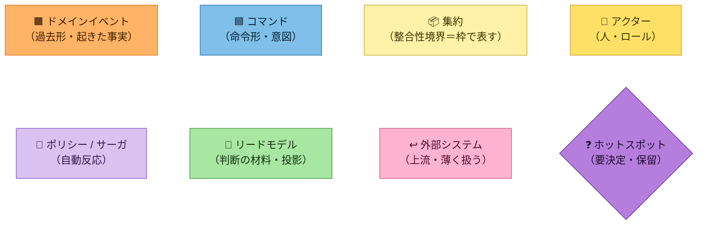

# イベントストーミングの進め方（3層）と、この分析の導出物語

> 目的: 「なぜ Big Picture ではイベントとトリガーしか置かないのか」「イベントから集約・ポリシーは
> どうやって導かれたのか」という*中間の分析プロセス*を可視化する。各成果物
> （[`01`](01-big-picture.md) / [`02`](02-process.md) / [`03`](03-software-design.md)）を読む前の地図。

## 表記の約束（このプロジェクト共通）
- **主表現は日本語**。散文・図の説明は日本語用語で書く（例: 手持在庫、引当済、引当可能）。
- **英名（コード識別子）はコードに繋ぐ時だけ**——[`../ubiquitous-language.md`](../ubiquitous-language.md) の英名列・Java 型名・コードブロックにのみ登場させる。
- 図（Mermaid）のノードは「日本語名（`EnglishName`）」で併記してよい（図はコードに近いため）。

## 付箋の色（イベントストーミング標準記法・**この節が正**）

図の配色は **Alberto Brandolini の標準付箋色**に準拠する。書籍・他社事例の図と並べてそのまま読めるようにするため。



| 要素 | 標準の付箋色 | 形 |
|---|---|---|
| ドメインイベント | **オレンジ** | 四角 |
| コマンド | **青** | 四角 |
| 集約 | **淡黄（大きい付箋）** | 枠（subgraph）を淡黄で塗る |
| アクター | **黄（小さい付箋）** | 四角 |
| ポリシー / サーガ | **ライラック（淡紫）** | 四角 |
| リードモデル | **緑** | 四角 |
| 外部システム | **ピンク** | 四角 |
| ホットスポット | **紫（45°回転）** | 菱形 |

**このプロジェクトでの補足（標準からの意図的なズレ）**

- **絵文字アイコンを併記する**（🟧🟦📦👤💜📄↩❓）。色覚特性やモノクロ印刷でも読めるようにするためで、
  色だけに意味を負わせない冗長性を優先した。
- **集約は「大きい付箋」ではなく枠（subgraph）を淡黄で塗る**。標準では集約も1枚の付箋だが、枠にすると
  **「枠をまたぐ＝別トランザクション＝ポリシーが要る」が目で見える**。色は標準どおり淡黄なので見た目は揃う。
- **時間の流れの向き**は図ごとに違う。①Big Picture は**左→右**（実際の壁と同じ時系列）、
  ②Process は**上→下**（壁ではなく*文法*の可視化＝👤→🟦→〔集約〕→🟧→💜 の連鎖を見せる図）。

## 3層で「貼るもの」を分ける
イベントストーミングは、段階ごとに付箋に貼る対象を意図的に絞る。**早い段で集約やポリシーに飛びつくと分析が痩せる**ので、下の順で我慢しながら積み上げる。

| 層 | この段で貼るもの | *まだ*貼らないもの | ねらい |
|---|---|---|---|
| ①Big Picture | 🟧ドメインイベント（過去形）・🟦外部トリガ・❓ホットスポット | 集約・ポリシー・アクター・リードモデル | 「何が起きたか」を発散的に洗い出す。結論を我慢する |
| ②Process | ①の各イベントの周りに 👤アクター・🟦コマンド・💜ポリシー・📄リードモデル・↩外部システム を貼る | 集約の確定・BC境界 | 「誰が・何の命令で・何を見て・どう連鎖するか」を通す |
| ③Software Design | ②のコマンド/イベントの塊を不変条件で括り、集約・BC・コアを確定 | （実装の詳細） | 設計への橋渡し |

つまり **「Big Picture がイベントとトリガーだけ」なのは正常**。集約・ポリシー・アクター・リードモデルは②で初めて登場する。

## 文法（②で1イベントを分解する型）
Process 段では、各ドメインイベントを次の「文型」で分解する。これを1枚ずつ当てていく作業が「中間の分析」の実体。

```
👤アクター ──発する──▶ 🟦コマンド ──扱う──▶ 〔集約〕 ──生む──▶ 🟧イベント
                                                              │
                                          📄リードモデル ◀──参照── 💜ポリシー ◀──反応──┘
                                                              │
                                                       次の🟦コマンド…（連鎖）
```

- **集約**は「そのコマンドの不変条件を守る責任者」を問うと浮かぶ（＝どの状態のまとまりが `NG` を判断するか）。
- **ポリシー**は「あるイベントが起きたら*自動的に*次の何が起こるべきか」を問うと浮かぶ（人の判断でなく規則）。
- **リードモデル**は「そのコマンドを出す前に人/ポリシーは何を見るか」を問うと浮かぶ。

---

## 導出の物語①：格納（putaway）— なぜ集約が2つに割れたか

1. Big Picture のイベント「**在庫が格納された**」から出発する。
2. ②の文法を当てる:
   - 👤アクター = 格納担当。🟦コマンド = 「格納する」。
   - この命令の不変条件は？ → 「格納先ロケーションが決まり、そのロケーションの手持在庫が増える」。
3. ここで詰まる（❓ホットスポット H6）: **格納の*前*、受入ドックの在庫はロケーションが未確定**。
   在庫集約は「SKU×ロケーション」で身元が決まるので、**ロケーション未確定の在庫を在庫集約に入れられない**。
4. →「ロケーションを持たない受入の器」が別に要る、と分かる。これが集約 **入荷（`InboundReceipt`）** の発見。
5. 格納は「入荷集約を減らす」と「在庫集約を増やす」の2つに割れる。**1トランザクション1集約**なので、
   これは1コマンドで両方を変えられない → イベント「在庫が格納された」に**反応するポリシー P1** が
   在庫集約へ「在庫を計上する」コマンドを送る（結果整合）。
6. こうして「イベント1つ」から **集約2つ＋ポリシー1本** が導かれた。

## 導出の物語②：引当（allocation）— なぜここがコアか

1. イベント「**在庫が引き当てられた**」から出発。
2. ②の文法:
   - 🟦コマンド = 「引き当てる」。不変条件 = **引当可能（＝手持在庫−引当済）≥ 要求量**。これを守る責任者 = 在庫集約。
   - 💜ポリシー = 「受注が受け付けられた」（外部トリガ）に反応して引当を起こす（P2）。
   - 📄リードモデル = ポリシーは「どのロケーションに引当可能があるか」を **引当可能在庫ビュー** で見て引当先を選ぶ。
3. この「**在庫を*どこから*どれだけ引き当てるか**の判断」こそ倉庫の差別化＝**コアサブドメイン（在庫引当）**。
   集約境界（SKU×ロケーション）が非自明なのも、判断が非自明なのも、すべてここに集中する。

## 導出の物語③：棚卸（stocktake）— なぜ棚卸は差異を知らないのか

1. Big Picture のイベント「**実地数量がカウントされた**」から出発。②の文法を当てると、次に何かが起きるはずだが——
   当時の図には `実地数量がカウントされた → 在庫差異が記録された` という**イベント→イベントの直線**があった。
   文法の唯一の違反（コマンドが不在）で、ここに**必ずコマンドが1枚要る**と分かる。
2. 埋めようとすると2つ問われる。**そのコマンドは誰宛か / 帳簿値をどこから手に入れるか**。
   棚卸集約は `StocktakeId` で身元が決まり、**在庫の帳簿値を知らない**（他集約はIDでしか参照できない）。
3. ここで H7 と同じ論法が効く。**在庫集約は自分の帳簿値を強整合で知っている唯一の存在**
   （自分のイベント列から導出するので絶対に古くない）。一方リードモデルは投影＝**結果整合**で、
   読んだ瞬間に古いかもしれない。
   → **差異をポリシーが計算してはいけない**。実地値だけ在庫集約へ渡せば、**差分は集約が自分で出せる**。
4. すると棚卸集約は差異を持つ必要がなくなる。責任分界はこうなる:
   **棚卸 = 実情の把握とレポート / 在庫 = 帳簿値の権威者として自分を直す**。
5. 残った「差異」の置き場所は、**引当可能と比べる**と決まる。
   引当可能（＝手持在庫−引当済）は*1集約の中*の導出値で、不変条件 ≥ 0 を守るから集約が持つ。
   差異（＝帳簿値−実地値）は*集約をまたぐ*導出値で、**誰の不変条件も守らない** → リードモデル（棚卸差異ビュー）。
   `StockDiscrepancyRecorded` は「新しい事実」ではなく**2つの事実の差**なので、イベントではなかった。
6. こうして P4 は「差異検出」から「**実情の伝達**」に変わり、P1（入口）/ P3（出口）と**同型**になった。
   → 発見: **在庫集約が受ける入力はすべて外から来た物理的事実**。棚の残高は 格納・ピッキング・棚卸 でしか動かない。

## 導出の物語④：凍結（freeze）— なぜ Saga はここにしか要らないのか

1. 物語③の設計には穴がある。**数えてから `AdjustStock` が届くまでの間に棚が動いたら**、
   補正が現実から逆に離れる（10:00に42個と数え、10:01にピッキングで40になり、10:02に「実地42」が届いて +2 される）。
2. 実務の解は**棚卸中はロケーションを凍結する**。ここで在庫集約に「凍結中」という受付ゲートが立つ。
   不変条件 引当可能 ≥ 0 は無傷で、**拒否するのは物理を動かすコマンド（格納・払出）だけ**。
   引当は物理を動かさない（`onHand` は変わらない）ので**通す**——止めると事業側の機会損失になるため。
3. 凍結対象は**複数の在庫集約**（棚Aに10SKUなら10集約）。1トランザクション1集約なので1件ずつ送るしかない。すると:
   - 対象集約の**列挙**が要る（棚卸集約は他集約を知らない → リードモデルを見る）
   - 全部凍結し終わるまでの**途中状態**が存在する
   - 数え終わったら**全部解凍**する必要があり、未解凍がどれかを覚えている主体が要る
4. **開始と終了があり、途中状態を覚えている** ＝ Process Manager（Saga）の定義そのもの。
   P1〜P4 は単発の伝播で状態を持たないので素直なイベントハンドラで足りる。
   **Axon の Saga を使う理由が「学習のため」ではなく「ドメインが要求したから」**になった瞬間。

> この2つの物語は、**文法の穴（イベント→イベントの直線）を埋めようとしたら集約の責任分界と Saga の必要性が芋づるで出てきた**例。
> 図を文法どおりに描き切ることが、それ自体で分析の道具になる。

## 導出の要点（他の集約も同じ手順）
- `Shipment`（出荷）: 出荷は 出荷指示→ピッキング→出荷 の*順序*という不変条件を持つ → 工程の状態を守る集約。

> この地図を踏まえて [`02-process.md`](02-process.md) を読むと、表と図が「文法を全イベントに当てた結果」だと分かる。
