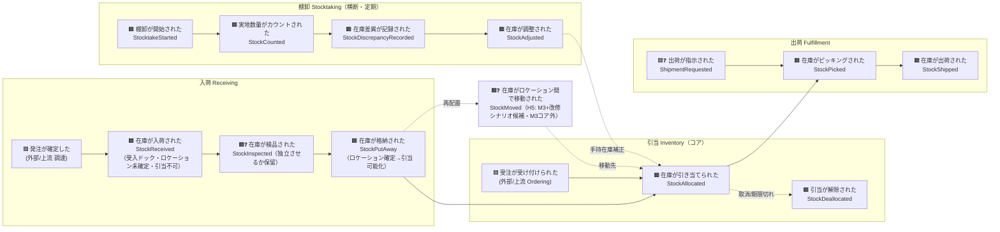

# イベントストーミング ①Big Picture（全体像）

> 対象ドメイン: スマート倉庫在庫管理（第1弾）。コア= **在庫引当（Stock Allocation）**。
> この段の狙い: 結論（集約/BC）に飛びつかず、**倉庫で起きた出来事（ドメインイベント＝過去形）**を時系列で洗い出し、
> 曖昧な点を **ホットスポット**として残す。集約・BC・コアの特定は ②プロセス / ③ソフトウェア設計 で行う。

## 用語の約束
- イベント = 過去形（起きた事実）。コマンド = 命令形（意図）。集約/値オブジェクト = 名詞。
- 命名規約は [`.claude/rules/ddd-ubiquitous-language.md`](../../.claude/rules/ddd-ubiquitous-language.md) に従う。
- **凡例**: 🟧 ドメインイベント / 🟦 外部トリガ（上流システム）/ ❓ ホットスポット（要決定・保留）。

## ドメインイベント時系列（Big Picture）

「モノが入る → 割り当てる → 出す」の主フローに、横断の「数える（棚卸）」が絡む。

## ドメインイベント一覧

| # | イベント（過去形） | 英名 | BC（暫定） | 備考 |
|---|---|---|---|---|
| 1 | 在庫が入荷された | `StockReceived` | Receiving | 受入ドック。ロケーション未確定・引当不可 |
| 2 | 在庫が検品された | `StockInspected` | Receiving | ❓独立イベント化するか保留（H8） |
| 3 | 在庫が格納された | `StockPutAway` | Receiving→Inventory | ロケーション確定。ここで手持在庫↑・引当可能化 |
| 4 | 在庫が引き当てられた | `StockAllocated` | **Inventory（コア）** | 引当可能（＝手持在庫−引当済）の範囲でのみ |
| 5 | 引当が解除された | `StockDeallocated` | **Inventory（コア）** | 取消/期限切れ等 |
| 6 | 在庫がピッキングされた | `StockPicked` | Fulfillment | ❓在庫量への影響タイミングは M2 で確定（H7） |
| 7 | 在庫が出荷された | `StockShipped` | Fulfillment | 引当済み分のみ出荷可 |
| 8 | 棚卸が開始された | `StocktakeStarted` | Stocktaking | |
| 9 | 実地数量がカウントされた | `StockCounted` | Stocktaking | |
| 10 | 在庫差異が記録された | `StockDiscrepancyRecorded` | Stocktaking | 帳簿値と実地値の差 |
| 11 | 在庫が調整された | `StockAdjusted` | Stocktaking→Inventory | 手持在庫を実地値へ補正（増減両方） |
| 12 | 在庫がロケーション間で移動された | `StockMoved` | Inventory | ❓H5: M3+改修シナリオ候補。2集約またぎ＝ポリシー/Saga |

## 外部トリガ（上流システム・薄く扱う）
- **発注が確定した**（調達/購買）→ 入荷の起点。
- **受注が受け付けられた**（Ordering）→ 引当の起点。**本PoCでは Ordering は薄い外部トリガ**として扱う。
- **出荷が指示された**（ShipmentRequested）→ ❓Fulfillment 内で発生させるか外部トリガか保留（H9）。

## ホットスポット（要決定・保留）

### 決定済み（本セッションで合意）
- **H1 集約粒度** = 在庫アイテム（`InventoryItem`）は **SKU × ロケーション**単位（不変条件 **引当可能 = 手持在庫 − 引当済 ≥ 0** をこの単位で守る）。
- **H2 引当対象** = 集約単位（SKU×ロケーション）へ **直接引当**（SKU総量への予約→後でロケーション確定、は採らない）。
- **H3 入荷粒度** = **2段**（受入 `StockReceived`＝ドック・引当不可 → 格納 `StockPutAway`＝引当可能化）。「まだ引けない在庫」状態を持つ。
- **H4 出荷粒度** = **2段**（`StockPicked` → `StockShipped`）。
- **H5 在庫移動** = `StockMoved` は **M3+ 改修シナリオ候補**（Big Picture には描くが M3 の最初のスライス外）。

### 未決（②プロセス / ③設計 / M2戦術で詰める）
- **H6 受入の集約帰属** ⚑重要: 受入ドック在庫は*ロケーション未確定*ゆえ `InventoryItem(SKU×ロケーション)` に属せない。→ **受入は別集約（入荷ロット / `InboundReceipt`）**で受け、**格納(putaway)で InventoryItem へ移す**境界が自然に立つ。②/③で確定。
- **H7 在庫量の増減タイミング**: ピッキング時 / 出荷時に 手持在庫・引当済 のどちらがいつ減るか（例: ピッキングで手持在庫↓・引当済↓、出荷は履歴事実のみ？）。M2 戦術で確定。
- **H8 検品の独立性**: `StockInspected` を独立イベントにするか、Received/PutAway に内包するか。
- **H9 出荷指示の出所**: `ShipmentRequested` は外部トリガか Fulfillment 集約が発生させるか。
- **H10 棚卸調整の表現**: `StockAdjusted` の符号（増減両方）と、補正/打ち消しイベントとしての位置づけ。

## 次工程への申し送り
- ②Process Modeling: 各イベントに **コマンド（命令形）・アクター・ポリシー・リードモデル**を紐付け、H6/H7/H9 を優先的に解く。
- ③Software Design: H6 を軸に **集約候補**（`InboundReceipt` / `InventoryItem` / 棚卸 / 出荷）と **BC境界・コンテキストマップ**、**コアサブドメイン（在庫引当）**、**ユビキタス言語表**を確定。
