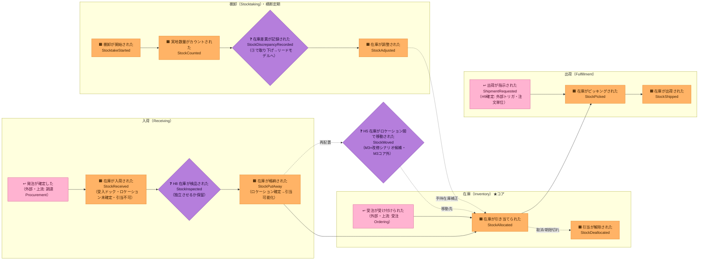

# イベントストーミング ①Big Picture（全体像）

> 対象ドメイン: スマート倉庫在庫管理（第1弾）。コア= **在庫引当（Stock Allocation）**。
> この段の狙い: 結論（集約/BC）に飛びつかず、**倉庫で起きた出来事（ドメインイベント＝過去形）**を時系列で洗い出し、
> 曖昧な点を **ホットスポット**として残す。集約・BC・コアの特定は ②プロセス / ③ソフトウェア設計 で行う。

## 用語の約束
- イベント = 過去形（起きた事実）。コマンド = 命令形（意図）。集約/値オブジェクト = 名詞。
- 命名規約は [`.claude/rules/ddd-ubiquitous-language.md`](../../.claude/rules/ddd-ubiquitous-language.md) に従う。
- **凡例**: 🟧 オレンジ = ドメインイベント / ↩ ピンク = 外部システム（上流トリガ）/ ❓ 紫の菱形 = ホットスポット（要決定・保留）。
  配色は [`00-method.md`「付箋の色」](00-method.md#付箋の色イベントストーミング標準記法この節が正) が正（イベントストーミング標準記法）。
  **この図の時間は左→右**＝実際の壁の時系列。
  ※ 以前は外部トリガに 🟦 を当てていたが、標準では**青はコマンド**なので↩ピンクへ改めた。

## ドメインイベント時系列（Big Picture）

「モノが入る → 割り当てる → 出す」の主フローに、横断の「数える（棚卸）」が絡む。

## ドメインイベント一覧

| # | イベント（過去形） | 英名 | BC（暫定） | 備考 |
|---|---|---|---|---|
| 1 | 在庫が入荷された | `StockReceived` | 入荷（Receiving） | 受入ドック。ロケーション未確定・引当不可 |
| 2 | 在庫が検品された | `StockInspected` | 入荷（Receiving） | ❓独立イベント化するか保留（H8） |
| 3 | 在庫が格納された | `StockPutAway` | 入荷（Receiving）→在庫（Inventory） | ロケーション確定。ここで手持在庫↑・引当可能化 |
| 4 | 在庫が引き当てられた | `StockAllocated` | **在庫（Inventory）★コア** | 引当可能（＝手持在庫−引当済）の範囲でのみ |
| 5 | 引当が解除された | `StockDeallocated` | **在庫（Inventory）★コア** | 取消/期限切れ等 |
| 6 | 在庫がピッキングされた | `StockPicked` | 出荷（Fulfillment） | ❓在庫量への影響タイミングは M2 で確定（H7） |
| 7 | 在庫が出荷された | `StockShipped` | 出荷（Fulfillment） | 引当済み分のみ出荷可 |
| 8 | 棚卸が開始された | `StocktakeStarted` | 棚卸（Stocktaking） | |
| 9 | 実地数量がカウントされた | `StockCounted` | 棚卸（Stocktaking） | |
| 10 | ~~在庫差異が記録された~~ | ~~`StockDiscrepancyRecorded`~~ | — | **取り下げ**（棚卸スライス）。差異は集約をまたぐ**導出値**でありイベント（新しい事実）ではない → 棚卸差異ビュー（リードモデル）へ |
| 11 | 在庫が調整された | `StockAdjusted` | 棚卸（Stocktaking）→在庫（Inventory） | 手持在庫を実情へ補正（増減両方）。**H10確定** |
| 12' | 在庫が凍結された／解凍された | `StockFrozen` / `StockUnfrozen` | 在庫（Inventory） | ②で追加。棚卸中は格納・払出を拒否（引当は通す） |
| 12 | 在庫がロケーション間で移動された | `StockMoved` | 在庫（Inventory） | ❓H5: M3+改修シナリオ候補。2集約またぎ＝ポリシー/Saga |

## 外部トリガ（上流システム・薄く扱う）
- **発注が確定した**（調達/購買）→ 入荷の起点。
- **受注が受け付けられた**（Ordering）→ 引当の起点。**本PoCでは Ordering は薄い外部トリガ**として扱う。
- **出荷が指示された**（ShipmentRequested）→ 薄い**外部トリガ**・**注文単位**（H9確定）。

## ホットスポット（要決定・保留）

### 決定済み（本セッションで合意）
- **H1 集約粒度** = 在庫（`InventoryItem`）は **SKU × ロケーション**単位（不変条件 **引当可能 = 手持在庫 − 引当済 ≥ 0** をこの単位で守る）。
- **H2 引当対象** = 集約単位（SKU×ロケーション）へ **直接引当**（SKU総量への予約→後でロケーション確定、は採らない）。
- **H3 入荷粒度** = **2段**（受入 `StockReceived`＝ドック・引当不可 → 格納 `StockPutAway`＝引当可能化）。「まだ引けない在庫」状態を持つ。
- **H4 出荷粒度** = **2段**（`StockPicked` → `StockShipped`）。
- **H5 在庫移動** = `StockMoved` は **M3+ 改修シナリオ候補**（Big Picture には描くが M3 の最初のスライス外）。

### 決定済み（②/③のウォークスルーで決着）
- **H6 受入の集約帰属**（②で解決）: 受入ドック在庫は*ロケーション未確定*ゆえ `InventoryItem(SKU×ロケーション)` に属せない。→ **受入は別集約（入荷 / `InboundReceipt`）**で受け、**格納(putaway)で InventoryItem へ移す**（ポリシー P1）。
- **H7 在庫量の増減タイミング**（2026-07-29 / 出荷スライス）: **ピッキング時**に 手持在庫↓・引当済↓（ポリシー P3 → `IssueStock`）。出荷は完了の事実のみ。同額ずつ減るので引当可能は不変。
- **H9 出荷指示の出所**（2026-07-29 / 出荷スライス）: 薄い**外部トリガ**のまま・**注文単位**。バッチ（ウェーブ）単位は M3+ 候補へ。
- **H10 棚卸調整の表現**（2026-08-01 / 棚卸スライス）: `AdjustStock` は**実地値（絶対値）**を渡し、`StockAdjusted` が**符号付き差分＋実地値＋原因**を持つ**補正**イベント。帳簿値を強整合で知るのは在庫集約だけ、という理由で決着。

### 未決（M2戦術で詰める）
- **H8 検品の独立性**: `StockInspected` を独立イベントにするか、Received/PutAway に内包するか。
- **H11 棚卸中の引当**（2026-08-01 追加 / 棚卸スライス）: 棚卸中に引当をどこまで許すか。本来は実績データに基づく数値判断（マイナス差異の発生率 vs 機会損失）。PoCには実績値がないため当面「引当は通す＋P2で引当先を後回し」で進め、実績が出たら見直す。→ M3+ 改修シナリオ候補②。

## 次工程への申し送り
- ②Process Modeling: 各イベントに **コマンド（命令形）・アクター・ポリシー・リードモデル**を紐付け、H6/H7/H9 を優先的に解く。
- ③Software Design: H6 を軸に **集約候補**（`InboundReceipt` / `InventoryItem` / 棚卸 / 出荷）と **BC境界・コンテキストマップ**、**コアサブドメイン（在庫引当）**、**ユビキタス言語表**を確定。
