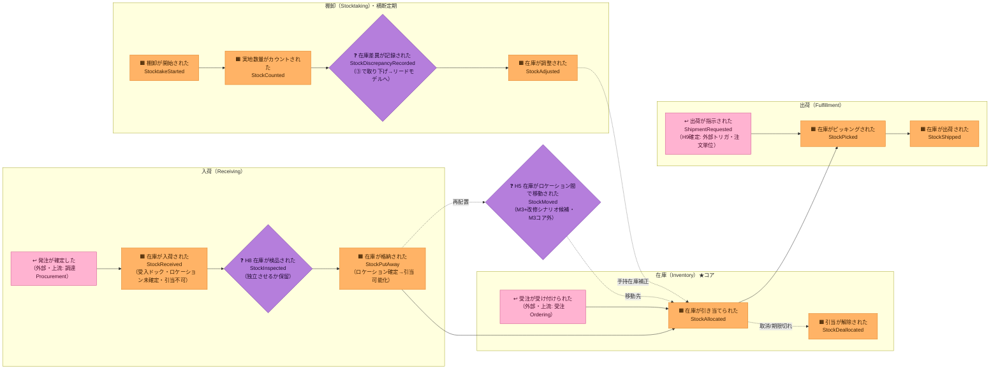

# イベントストーミング ①Big Picture（全体像）

> 対象ドメイン: スマート倉庫在庫管理（第1弾）。コア= **在庫引当（Stock Allocation）**。
> この段の狙い: 結論（集約/BC）に飛びつかず、**倉庫で起きた出来事（ドメインイベント＝過去形）**を時系列で洗い出し、
> 曖昧な点を **ホットスポット**として残す。集約・BC・コアの特定は ②プロセス / ③ソフトウェア設計 で行う。
>
> ⚠ **この文書は M1 時点の分析記録**。後から決まったことで表・図は書き換えず、注記だけを足している
> （何がいつ見えたかという順序自体が学習素材のため）。**現在の用語・イベント・コマンドの一覧は
> [`../ubiquitous-language.md`](../ubiquitous-language.md)、決定の正は [`../decisions.md`](../decisions.md) が正**。

## 用語の約束
- イベント = 過去形（起きた事実）。コマンド = 命令形（意図）。集約/値オブジェクト = 名詞。
- 命名規約は [`.claude/rules/ddd-ubiquitous-language.md`](../../.claude/rules/ddd-ubiquitous-language.md) に従う。
- **凡例**: 🟧 オレンジ = ドメインイベント / ↩ ピンク = 外部システム（上流トリガ）/ ❓ 紫の菱形 = ホットスポット（要決定・保留）。
  配色は [`00-method.md`「付箋の色」](00-method.md#付箋の色イベントストーミング標準記法この節が正) が正（イベントストーミング標準記法）。
  **この図の時間は左→右**＝実際の壁の時系列。
  ※ 以前は外部トリガに 🟦 を当てていたが、標準では**青はコマンド**なので↩ピンクへ改めた。

## ドメインイベント時系列（Big Picture）

「モノが入る → 割り当てる → 出す」の主フローに、横断の「数える（棚卸）」が絡む。

## ドメインイベント一覧

| # | イベント（過去形） | 英名 | BC（暫定） | 備考 |
|---|---|---|---|---|
| 1 | 在庫が入荷された | `StockReceived` | 入荷（Receiving） | 受入ドック。ロケーション未確定・引当不可 |
| 2 | 在庫が検品された | `StockInspected` | 入荷（Receiving） | ❓独立イベント化するか保留（H8） |
| 3 | 在庫が格納された | `StockPutAway` | 入荷（Receiving）→在庫（Inventory） | ロケーション確定。ここで手持在庫↑・引当可能化 |
| 4 | 在庫が引き当てられた | `StockAllocated` | **在庫（Inventory）★コア** | 引当可能（＝手持在庫−引当済）の範囲でのみ |
| 5 | 引当が解除された | `StockDeallocated` | **在庫（Inventory）★コア** | 取消/期限切れ等 |
| 6 | 在庫がピッキングされた | `StockPicked` | 出荷（Fulfillment） | ❓在庫量への影響タイミングは M2 で確定（H7） |
| 7 | 在庫が出荷された | `StockShipped` | 出荷（Fulfillment） | 引当済み分のみ出荷可 |
| 8 | 棚卸が開始された | `StocktakeStarted` | 棚卸（Stocktaking） | |
| 9 | 実地数量がカウントされた | `StockCounted` | 棚卸（Stocktaking） | |
| 10 | ~~在庫差異が記録された~~ | ~~`StockDiscrepancyRecorded`~~ | — | **取り下げ**（棚卸スライス）。差異は集約をまたぐ**導出値**でありイベント（新しい事実）ではない → 棚卸差異ビュー（リードモデル）へ |
| 11 | 在庫が調整された | `StockAdjusted` | 棚卸（Stocktaking）→在庫（Inventory） | 手持在庫を実情へ補正（増減両方）。**H10確定** |
| 12' | 在庫が凍結された／解凍された | `StockFrozen` / `StockUnfrozen` | 在庫（Inventory） | ②で追加。棚卸中は格納・払出を拒否（引当は通す） |
| 12 | 在庫がロケーション間で移動された | `StockMoved` | 在庫（Inventory） | ❓H5: M3+改修シナリオ候補。2集約またぎ＝ポリシー/Saga |

## 外部トリガ（上流システム・薄く扱う）
- **発注が確定した**（調達/購買）→ 入荷の起点。
- **受注が受け付けられた**（Ordering）→ 引当の起点。**本PoCでは Ordering は薄い外部トリガ**として扱う。
- **出荷が指示された**（ShipmentRequested）→ 薄い**外部トリガ**・**注文単位**（H9確定）。

## ホットスポット（要決定・保留）

**この段で挙がった論点の一覧**。決定の理由・却下した選択肢・帰結は
[`../decisions.md`](../decisions.md)（ADR）が正——ここには結果だけを置く。

| # | 論点 | 結果 | どこで決着したか |
|---|---|---|---|
| [H1](../decisions.md#h1-在庫集約の粒度) | 在庫集約の粒度 | SKU × ロケーション | この段 |
| [H2](../decisions.md#h2-引当の対象) | 引当の対象 | 集約単位へ直接引当 | この段 |
| [H3](../decisions.md#h3-入荷の粒度) | 入荷の粒度 | 2段（受入 → 格納）。「まだ引けない在庫」を持つ | この段 |
| [H4](../decisions.md#h4-出荷の粒度) | 出荷の粒度 | 2段（ピッキング → 出荷） | この段 |
| [H5](../decisions.md#h5-ロケーション間の在庫移動) | ロケーション間の在庫移動 | **保留** → M3+ 改修シナリオ候補 | — |
| [H6](../decisions.md#h6-受入在庫の集約帰属) | 受入在庫の集約帰属 | 別集約（入荷 `InboundReceipt`）＋ポリシー P1 | ②Process |
| [H7](../decisions.md#h7-在庫量が減るタイミング) | 在庫量が減るタイミング | ピッキング時（出荷は完了の事実のみ） | ②Process |
| [H8](../decisions.md#h8-検品を独立させるか) | 検品を独立させるか | 独立させない（入荷に内包） | M2 戦術設計 |
| [H9](../decisions.md#h9-出荷指示の出所と粒度) | 出荷指示の出所と粒度 | 外部トリガ・注文単位 | ②Process |
| [H10](../decisions.md#h10-棚卸調整の表現) | 棚卸調整の表現 | 実地値を渡し差分は在庫集約が出す | ②Process |
| [H11](../decisions.md#h11-棚卸中の引当をどこまで許すか) | 棚卸中の引当 | **暫定**: 通す＋P2で後回し | ②Process |

> H12（M2で新規発見）は分析段階では見えなかった論点のため、この一覧には現れない → [`../decisions.md`](../decisions.md#h12-実地値が引当済を下回る棚卸調整)

## 次工程への申し送り
- ②Process Modeling: 各イベントに **コマンド（命令形）・アクター・ポリシー・リードモデル**を紐付け、H6/H7/H9 を優先的に解く。
- ③Software Design: H6 を軸に **集約候補**（`InboundReceipt` / `InventoryItem` / 棚卸 / 出荷）と **BC境界・コンテキストマップ**、**コアサブドメイン（在庫引当）**、**ユビキタス言語表**を確定。
