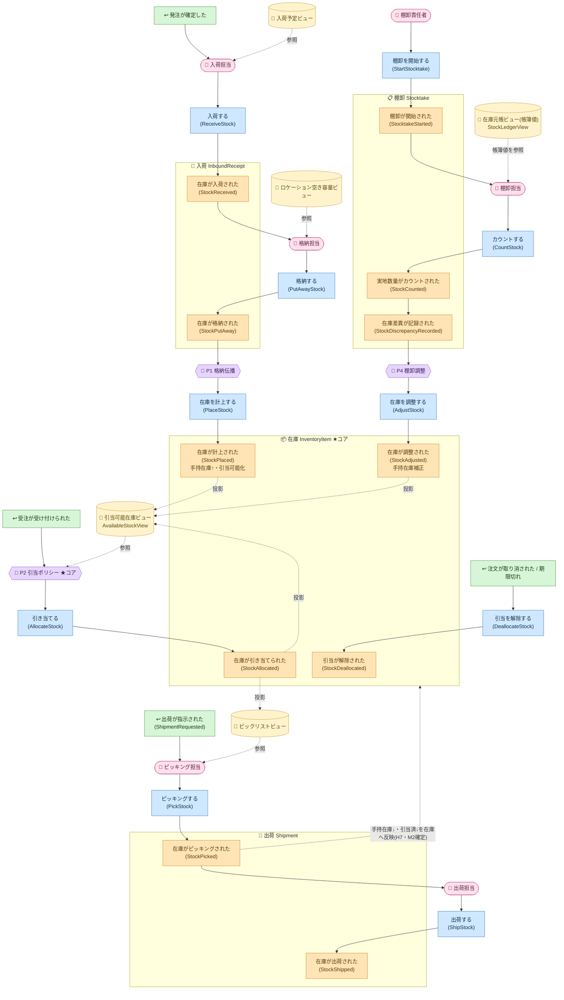

# イベントストーミング ②Process Modeling（プロセス）

> 前段: [`01-big-picture.md`](01-big-picture.md)。この段の狙い: 各ドメインイベントに
> **コマンド（命令形）・アクター・ポリシー・リードモデル**を紐付け、コマンド→イベントの流れと
> **集約をまたぐ結果整合（ポリシー/Saga）**を明らかにする。集約の最終確定・BC境界・ユビキタス言語は ③で行う。

## 決定を受けて立ち上がった集約（4つ）
H1〜H6 の決定から、整合性境界（不変条件を守る最小単位）として次の4集約が浮かぶ。

| 集約 | BC | 識別子 | 主な状態 | 不変条件 |
|---|---|---|---|---|
| 入荷（`InboundReceipt`） | 入荷（Receiving） | `ReceiptId` | SKU・受入量・残格納量 | 格納総量 ≤ 受入量（残量を負にしない） |
| **在庫（`InventoryItem`）★コア** | **在庫（Inventory）** | **`(Sku, LocationId)`** | 手持在庫・引当済 | **引当可能 = 手持在庫 − 引当済 ≥ 0** |
| 出荷（`Shipment`） | 出荷（Fulfillment） | `ShipmentId` | 明細（SKU・ロケーション・数量）・状態 | 出荷は引当済み分のみ・出荷指示→ピッキング→出荷 の順 |
| 棚卸（`Stocktake`） | 棚卸（Stocktaking） | `StocktakeId` | 対象範囲・カウント・差異 | カウントは対象ロケーションに対してのみ |

> BC と集約が同名になるのは正常（例: 注文コンテキストの中心にある集約は注文集約）。**BCの名前はその領域の中心概念から取られる**ため。
> 区別は名前ではなく**種別語**が担う（「入荷コンテキスト」「入荷集約」）。詳細は [`03-software-design.md`](03-software-design.md) の「集約の判定基準」。

## コマンド → イベント（アクター・ポリシー・リードモデル）

### 入荷コンテキスト（Receiving）— 入荷集約（`InboundReceipt`）
| コマンド（命令形） | アクター | 生成イベント | 参照リードモデル | 備考 |
|---|---|---|---|---|
| 入荷する（`ReceiveStock`） | 入荷担当 | 在庫が入荷された（`StockReceived`） | 入荷予定ビュー（発注情報・任意） | 外部トリガ「発注が確定した」を起点。ロケーション未確定 |
| 検品する（`InspectStock`）❓H8 | 検品担当 | 在庫が検品された（`StockInspected`） | — | 独立化するかは保留。合否を記録 |
| 格納する（`PutAwayStock`） | 格納担当 | 在庫が格納された（`StockPutAway`） | ロケーション空き容量ビュー | 格納先ロケーションを選定。入荷の残格納量を引き落とす |

### 在庫コンテキスト（Inventory）★コア — 在庫集約（`InventoryItem`）
| コマンド | アクター/起点 | 生成イベント | 参照リードモデル | 備考 |
|---|---|---|---|---|
| 在庫を計上する（`PlaceStock`） | ポリシーP1（格納伝播） | 在庫が計上された（`StockPlaced`） | — | 手持在庫↑・引当可能化。格納の在庫（Inventory）側の帰結 |
| 引き当てる（`AllocateStock`） | ポリシーP2（引当） | 在庫が引き当てられた（`StockAllocated`） | 引当可能在庫ビュー（`AvailableStockView`） | 引当可能 ≥ 要求量 の時のみ。違反は例外（イベント発行せず） |
| 引当を解除する（`DeallocateStock`） | 引当取消/期限切れ | 引当が解除された（`StockDeallocated`） | 引当ビュー（`AllocationView`） | 取消・タイムアウト等 |
| 在庫を調整する（`AdjustStock`） | ポリシーP4（棚卸調整） | 在庫が調整された（`StockAdjusted`） | — | 手持在庫を実地値へ補正（増減両方） |

### 出荷コンテキスト（Fulfillment）— 出荷集約（`Shipment`）
| コマンド | アクター/起点 | 生成イベント | 参照リードモデル | 備考 |
|---|---|---|---|---|
| 出荷を指示する（`RequestShipment`）❓H9 | 外部トリガ or 出荷計画 | 出荷が指示された（`ShipmentRequested`） | 引当ビュー（`AllocationView`） | PoC では上流からの薄い外部トリガとして扱う（暫定） |
| ピッキングする（`PickStock`） | ピッキング担当 | 在庫がピッキングされた（`StockPicked`） | ピックリストビュー | 物理的に棚から取る。**H7**: ここで手持在庫↓・引当済↓（暫定既定） |
| 出荷する（`ShipStock`） | 出荷担当 | 在庫が出荷された（`StockShipped`） | — | 出荷完了の事実。**H7**: 在庫の数量はピッキングで確定済み（暫定既定） |

### 棚卸コンテキスト（Stocktaking）— 棚卸集約（`Stocktake`）
| コマンド | アクター | 生成イベント | 参照リードモデル | 備考 |
|---|---|---|---|---|
| 棚卸を開始する（`StartStocktake`） | 棚卸責任者 | 棚卸が開始された（`StocktakeStarted`） | 対象ロケーション一覧 | 対象範囲を確定 |
| カウントする（`CountStock`） | 棚卸担当 | 実地数量がカウントされた（`StockCounted`） | — | 実地数量を記録 |
| （差異検出） | ポリシー | 在庫差異が記録された（`StockDiscrepancyRecorded`） | 在庫元帳ビュー（`StockLedgerView`／帳簿値） | 帳簿値と実地値の差 |

## ポリシー（集約をまたぐ結果整合 = Saga / Process Manager）
「1トランザクション1集約」を守るため、集約をまたぐ整合はイベント→ポリシー→コマンドで結果整合にする。

| ポリシー | 反応するイベント | 発行するコマンド | またぐ集約 | 役割 |
|---|---|---|---|---|
| **P1 格納伝播（PutawayProcess）** | 在庫が格納された（`StockPutAway`／入荷） | 在庫を計上する（`PlaceStock`／在庫） | 入荷 → 在庫 | 入荷集約から在庫集約へ在庫を移す |
| **P2 引当（AllocationPolicy）★コア** | 「受注が受け付けられた」（外部） | 引き当てる（`AllocateStock`／在庫） | 受注（Ordering・外部） → 在庫 | 引当可能在庫ビューを見て引当先ロケーションを選定・引当 |
| **P3 出庫反映（FulfillmentProcess）** | 在庫がピッキングされた（`StockPicked`／出荷） | （在庫の数量を減らすコマンド）※H7 | 出荷 → 在庫 | ピッキングを在庫へ反映（手持在庫↓・引当済↓）。**具体はH7でM2確定**。※`PickStock`/`ShipStock` 自体は👤アクター駆動でポリシーではない |
| **P4 棚卸調整（AdjustmentPolicy）** | 在庫差異が記録された（`StockDiscrepancyRecorded`／棚卸） | 在庫を調整する（`AdjustStock`／在庫） | 棚卸 → 在庫 | 実地差異を在庫へ反映（補正） |

## プロセス全体図（👤アクター/↩外部 →（📄リードモデル参照）→ 🟦コマンド →〔集約〕→ 🟧イベント →💜ポリシー）

**文法を完全化**した図。コマンドは必ず **👤アクター（📄リードモデルを見て判断）/ 💜ポリシー（自動反応）/ ↩外部システム** のいずれかが発する
＝**イベントが直接コマンドを生む線は無い**。集約は点線枠＝整合性境界（コマンドが枠に入り枠内でイベントが出る）。
枠をまたぐ自動連鎖は💜ポリシー経由（1Tx1集約）。リードモデルはイベントから投影（CQRS、点線「投影」）。

> 読み方: **コマンド（青）の手前には必ず 👤/💜/↩ がある**＝「誰・何が決めたか」が見える。枠（集約）をまたぐ自動連鎖は💜ポリシー経由（1Tx1集約）。
> 📄リードモデルは点線「投影」でイベントから作られ（CQRS）、👤や💜が判断時に参照する。★=コアの引当。

### 発見: 各コマンドは「自動（ポリシー）」か「人の判断（アクター＋リードモデル）」か
文法を完全化すると、**何が自動化され何が人の判断か**が一望できる（これ自体が設計上の発見）。

| コマンド | 発生源 | 種別 | 参照リードモデル |
|---|---|---|---|
| 入荷する / 格納する | 👤入荷担当 / 👤格納担当 | 人の判断 | 入荷予定 / ロケーション空き容量 |
| 在庫を計上する | 💜P1 格納伝播 | 自動 | — |
| **引き当てる ★コア** | 💜P2 引当ポリシー | 自動 | 引当可能在庫ビュー |
| 引当を解除する | ↩注文取消 / 期限切れ | 外部・タイマー | — |
| ピッキングする / 出荷する | 👤ピッキング担当 / 👤出荷担当 | 人の判断 | ピックリスト |
| 棚卸を開始する / カウントする | 👤棚卸責任者 / 👤棚卸担当 | 人の判断 | 在庫元帳(帳簿値) |
| 在庫を調整する | 💜P4 棚卸調整 | 自動 | — |

**含意**: コア（引当）は**自動化**され、入出庫の物理作業は**人**が担う。将来「引当先を人が選ぶ」「格納を自動化」等の変更は、この*発生源の差し替え*として現れる（M3+改修シナリオの着眼点）。

## この段で解けた / 残した論点
- **H6 解決**: 受入は `InboundReceipt` 集約、格納(putaway)で `InventoryItem` へ移す（ポリシー P1）。→ ③で BC 境界に反映。
- **H7 暫定既定**（M2戦術で確定）: `AllocateStock` で引当済↑（引当可能≥要求量が条件）。`StockPicked` で手持在庫↓・引当済↓（棚から出て予約が消化）。`StockShipped` は出荷完了の事実で在庫の数量はピッキングで確定済み。→ *別案*: 出荷で手持在庫↓にまとめる。M2 で確定。
- **H9 暫定既定**: `ShipmentRequested` は上流からの薄い外部トリガ扱い（PoC簡素化）。将来 出荷（Fulfillment）側の出荷計画ポリシーへ格上げ可。
- **H8 保留**: `StockInspected` の独立化は未決（Received/PutAway に内包する簡素案が既定寄り）。
- **H5 保留**: `StockMoved`（ロケーション間移動）は M3+ 改修シナリオ候補（P1 と同型の2集約またぎ）。

## 次工程（③Software Design）への申し送り
- 4集約を核に **BC境界の確定 → コンテキストマップ**（受注（Ordering）は上流の外部トリガ＝Customer/Supplier 関係）。
- **コアサブドメイン = 在庫引当（P2 AllocationPolicy ＋ InventoryItem の不変条件）**を明示し、支援（Receiving/Fulfillment/Stocktaking）・汎用と区別。
- **ユビキタス言語表**（用語・意味・英名）を確定。
