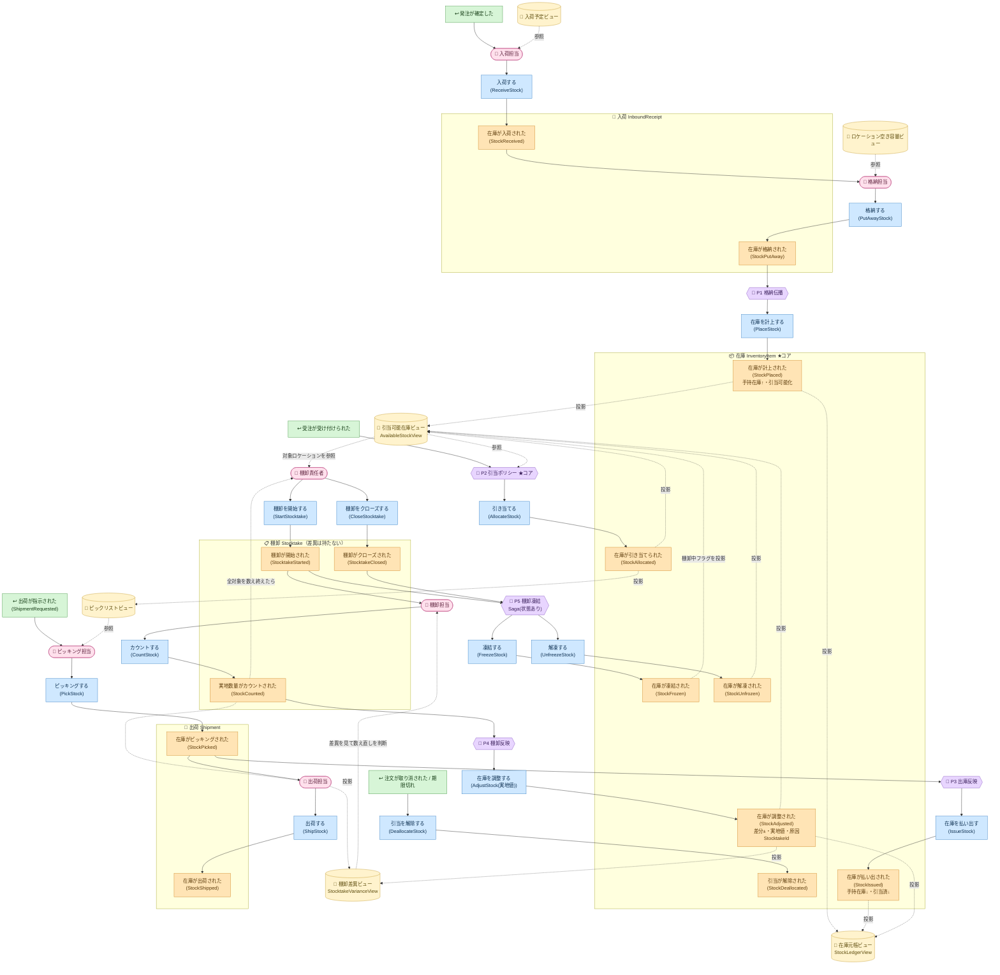

# イベントストーミング ②Process Modeling（プロセス）

> 前段: [`01-big-picture.md`](01-big-picture.md)。この段の狙い: 各ドメインイベントに
> **コマンド（命令形）・アクター・ポリシー・リードモデル**を紐付け、コマンド→イベントの流れと
> **集約をまたぐ結果整合（ポリシー/Saga）**を明らかにする。集約の最終確定・BC境界・ユビキタス言語は ③で行う。

## 決定を受けて立ち上がった集約（4つ）
H1〜H6 の決定から、整合性境界（不変条件を守る最小単位）として次の4集約が浮かぶ。

| 集約 | BC | 識別子 | 主な状態 | 不変条件 |
|---|---|---|---|---|
| 入荷（`InboundReceipt`） | 入荷（Receiving） | `ReceiptId` | SKU・受入量・残格納量 | 格納総量 ≤ 受入量（残量を負にしない） |
| **在庫（`InventoryItem`）★コア** | **在庫（Inventory）** | **`(Sku, LocationId)`** | 手持在庫・引当済 | **引当可能 = 手持在庫 − 引当済 ≥ 0** |
| 出荷（`Shipment`） | 出荷（Fulfillment） | `ShipmentId` | 明細（SKU・ロケーション・数量）・状態 | 出荷は引当済み分のみ・出荷指示→ピッキング→出荷 の順 |
| 棚卸（`Stocktake`） | 棚卸（Stocktaking） | `StocktakeId` | 対象範囲・カウント・差異 | カウントは対象ロケーションに対してのみ |

> BC と集約が同名になるのは正常（例: 注文コンテキストの中心にある集約は注文集約）。**BCの名前はその領域の中心概念から取られる**ため。
> 区別は名前ではなく**種別語**が担う（「入荷コンテキスト」「入荷集約」）。詳細は [`03-software-design.md`](03-software-design.md) の「集約の判定基準」。

## コマンド → イベント（アクター・ポリシー・リードモデル）

### 入荷コンテキスト（Receiving）— 入荷集約（`InboundReceipt`）
| コマンド（命令形） | アクター | 生成イベント | 参照リードモデル | 備考 |
|---|---|---|---|---|
| 入荷する（`ReceiveStock`） | 入荷担当 | 在庫が入荷された（`StockReceived`） | 入荷予定ビュー（発注情報・任意） | 外部トリガ「発注が確定した」を起点。ロケーション未確定 |
| 検品する（`InspectStock`）❓H8 | 検品担当 | 在庫が検品された（`StockInspected`） | — | 独立化するかは保留。合否を記録 |
| 格納する（`PutAwayStock`） | 格納担当 | 在庫が格納された（`StockPutAway`） | ロケーション空き容量ビュー | 格納先ロケーションを選定。入荷の残格納量を引き落とす |

### 在庫コンテキスト（Inventory）★コア — 在庫集約（`InventoryItem`）
| コマンド | アクター/起点 | 生成イベント | 参照リードモデル | 備考 |
|---|---|---|---|---|
| 在庫を計上する（`PlaceStock`） | ポリシーP1（格納伝播） | 在庫が計上された（`StockPlaced`） | — | 手持在庫↑・引当可能化。格納の在庫（Inventory）側の帰結 |
| 引き当てる（`AllocateStock`） | ポリシーP2（引当） | 在庫が引き当てられた（`StockAllocated`） | 引当可能在庫ビュー（`AvailableStockView`） | 引当可能 ≥ 要求量 の時のみ。違反は例外（イベント発行せず）。引当先選定では**棚卸中ロケーションを後回し**（→H11） |
| 引当を解除する（`DeallocateStock`） | 引当取消/期限切れ | 引当が解除された（`StockDeallocated`） | 引当ビュー（`AllocationView`） | 取消・タイムアウト等 |
| 在庫を払い出す（`IssueStock`） | ポリシーP3（出庫反映） | 在庫が払い出された（`StockIssued`） | — | ピッキングの帰結。手持在庫↓・引当済↓（同額ずつ減るので引当可能は不変）。**H7確定** |
| 在庫を調整する（`AdjustStock`） | ポリシーP4（棚卸反映） | 在庫が調整された（`StockAdjusted`） | — | **実地値を渡し、差分は集約が出す**（帳簿値を強整合で知るのは集約だけ）。増減両方。**H10確定** |
| 凍結する（`FreezeStock`） | サーガP5（棚卸凍結） | 在庫が凍結された（`StockFrozen`） | — | 棚卸対象になった。以降 物理を動かすコマンドを拒否 |
| 解凍する（`UnfreezeStock`） | サーガP5（棚卸凍結） | 在庫が解凍された（`StockUnfrozen`） | — | 棚卸クローズで通常運用へ戻す |

> **凍結中の受付可否**（棚卸スライスで確定）: 物理が動く **`PlaceStock`（格納）/ `IssueStock`（払出）は拒否**、
> 物理が動かない **`AllocateStock`（引当）は通す**、`AdjustStock` は棚卸のためのコマンドなので当然通す。
> 引当を通す代わりに、露出は **P2 が引当先選定で棚卸中ロケーションを後回しにする**ことで下げる（→ H11）。
> 在庫集約に足すのは「**凍結中は物理を動かすコマンドを拒否する**」の一文だけで、
> 不変条件 引当可能 ≥ 0 は無傷＝支援サブドメインの都合がコアに混ざらない。

### 出荷コンテキスト（Fulfillment）— 出荷集約（`Shipment`）
| コマンド | アクター/起点 | 生成イベント | 参照リードモデル | 備考 |
|---|---|---|---|---|
| 出荷を指示する（`RequestShipment`） | 外部トリガ | 出荷が指示された（`ShipmentRequested`） | 引当ビュー（`AllocationView`） | 上流からの薄い外部トリガ・**注文単位**（**H9確定**） |
| ピッキングする（`PickStock`） | ピッキング担当 | 在庫がピッキングされた（`StockPicked`） | ピックリストビュー | 物理的に棚から取る。在庫側の残高はポリシー P3 が減らす（**H7確定**） |
| 出荷する（`ShipStock`） | 出荷担当 | 在庫が出荷された（`StockShipped`） | — | 出荷完了の事実のみ。在庫の残高はピッキングで確定済み（**H7確定**） |

### 棚卸コンテキスト（Stocktaking）— 棚卸集約（`Stocktake`）
**責任分界（棚卸スライスで確定）**: 棚卸は「棚Aには42個あった」という**実情の把握とレポート**に徹する。
**差異を持たない・知らない**。帳簿値の権威者は在庫集約（自分のイベント列から導出＝強整合）なので、
実地値を渡せば**差分は在庫集約が自分で出せる**。差異（帳簿値−実地値）は集約をまたぐ**導出値**であり、
誰の不変条件も守らないため、リードモデル（**棚卸差異ビュー**）に置く。
＝ 引当可能（1集約内の導出値・不変条件を守るので集約が持つ）と対になる線引き。

| コマンド | アクター | 生成イベント | 参照リードモデル | 備考 |
|---|---|---|---|---|
| 棚卸を開始する（`StartStocktake`） | 棚卸責任者 | 棚卸が開始された（`StocktakeStarted`） | 引当可能在庫ビュー（対象ロケーションの在庫を確認） | **循環棚卸＝ロケーション単位**で対象範囲を確定 |
| カウントする（`CountStock`） | 棚卸担当 | 実地数量がカウントされた（`StockCounted`） | 棚卸差異ビュー（`StocktakeVarianceView`） | 実地数量を記録。差異が大きければ**同じコマンドで数え直す** |
| 棚卸をクローズする（`CloseStocktake`） | 棚卸責任者 | 棚卸がクローズされた（`StocktakeClosed`） | — | 全対象を数え終えたら終了。→ P5 が解凍する |

> **対象範囲はロケーション1軸**（SKU軸・カテゴリ軸を別に持たない）。倉庫のロケーションは商品特性
> （温度帯・回転率・サイズ）で**ゾーニング**されているため、「カテゴリで棚卸したい」は実務上ほぼ
> 「そのゾーンを棚卸する」で足りる。在庫集約の識別子が `(Sku, LocationId)` なので、
> **ロケーションを指定すると対象の在庫集約が一意に決まる**（棚Aにある全SKU）点でも軸が噛み合う。

## ポリシー（集約をまたぐ結果整合 = Saga / Process Manager）
「1トランザクション1集約」を守るため、集約をまたぐ整合はイベント→ポリシー→コマンドで結果整合にする。

| ポリシー | 反応するイベント | 発行するコマンド | またぐ集約 | 役割 |
|---|---|---|---|---|
| **P1 格納伝播（`PutawayPolicy`）** | 在庫が格納された（`StockPutAway`／入荷） | 在庫を計上する（`PlaceStock`／在庫） | 入荷 → 在庫 | 入荷集約から在庫集約へ在庫を移す。手持在庫 ↑ |
| **P2 引当（`AllocationPolicy`）★コア** | 「受注が受け付けられた」（外部） | 引き当てる（`AllocateStock`／在庫） | 受注（Ordering・外部） → 在庫 | 引当可能在庫ビューを見て引当先ロケーションを選定・引当。**棚卸中ロケーションは後回し**（→H11） |
| **P3 出庫反映（`FulfillmentPolicy`）** | 在庫がピッキングされた（`StockPicked`／出荷） | 在庫を払い出す（`IssueStock`／在庫） | 出荷 → 在庫 | ピッキングを在庫へ反映。手持在庫 ↓。※`PickStock`/`ShipStock` 自体は👤アクター駆動でポリシーではない |
| **P4 棚卸反映（`StocktakePolicy`）** | 実地数量がカウントされた（`StockCounted`／棚卸） | 在庫を調整する（`AdjustStock(実地値)`／在庫） | 棚卸 → 在庫 | 実地値をそのまま在庫へ渡す（差分は在庫が出す）。手持在庫 ↕ |
| **P5 棚卸凍結（`StocktakeFreezeSaga`）★唯一のSaga** | 棚卸が開始された／クローズされた（`StocktakeStarted`／`StocktakeClosed`） | 凍結する／解凍する（`FreezeStock`／`UnfreezeStock`／在庫） | 棚卸 → 在庫（**複数**） | 対象ロケーションの在庫集約を列挙し1件ずつ凍結／クローズで解凍。**状態を持つ**（何件凍結済みか・未解凍はどれか） |

### 発見: 4本は単発の伝播、1本だけが Process Manager
P1・P3・P4 は**同型**である——「他のBCで起きた**物理的な事実**を、在庫の残高へ反映する」だけ。

```
P1 格納伝播 : 🟧在庫が格納された（入荷）      → 🟦在庫を計上する   → 手持在庫 ↑
P3 出庫反映 : 🟧在庫がピッキングされた（出荷） → 🟦在庫を払い出す   → 手持在庫 ↓
P4 棚卸反映 : 🟧実地数量がカウントされた（棚卸）→ 🟦在庫を調整する   → 手持在庫 ↕
```

差異検出という*計算*を担っていた旧 P4 だけが異物だったが、実情の伝達に揃った。ここから
**在庫集約が受ける入力はすべて外から来た物理的事実**だと読める（自分からは動かない。棚の残高は
入口＝格納・出口＝ピッキング・現実との突き合わせ＝棚卸 でしか変わらない）。

対して **P5 だけが本物の Saga（Process Manager）**。対象ロケーションの在庫集約は複数あり
（棚Aに10SKUなら10集約）、1トランザクション1集約なので1件ずつ凍結するしかない。
→ ①対象集約の**列挙**が要る（棚卸集約は他集約を知らないのでリードモデルを見る）
②全部凍結し終わるまでの**途中状態**が存在する ③数え終わったら**全部解凍**する必要があり、
未解凍がどれかを覚えている主体が要る。**開始と終了があり途中状態を持つ**＝ Saga の定義そのもの。

**含意（M2/M3の設計判断が1つ片付く）**: P1〜P4 は状態を持たないので素直なイベントハンドラで十分、
**Axon の Saga を使うのは P5 だけ**。使う理由が「学習のため」ではなく**ドメインが要求したから**になる。
語尾もこれに合わせた（状態なし＝`...Policy` / 状態あり＝`...Saga`）。

> ⚠ **凍結対象の列挙は結果整合**（リードモデル経由）。直前に格納された在庫が投影に載っておらず
> 凍結漏れする可能性がある。PoCでは許容し、ホットスポットとして記録する（実務では格納側も
> 同じロケーション単位でロックする等の対策が要る）。リスク窓は循環棚卸の粒度を小さくするほど縮む。

## プロセス全体図（👤アクター/↩外部 →（📄リードモデル参照）→ 🟦コマンド →〔集約〕→ 🟧イベント →💜ポリシー）

**文法を完全化**した図。コマンドは必ず **👤アクター（📄リードモデルを見て判断）/ 💜ポリシー（自動反応）/ ↩外部システム** のいずれかが発する
＝**イベントが直接コマンドを生む線は無い**。集約は点線枠＝整合性境界（コマンドが枠に入り枠内でイベントが出る）。
枠をまたぐ自動連鎖は💜ポリシー経由（1Tx1集約）。リードモデルはイベントから投影（CQRS、点線「投影」）。



> 読み方: **コマンド（青）の手前には必ず 👤/💜/↩ がある**＝「誰・何が決めたか」が見える。枠（集約）をまたぐ自動連鎖は💜ポリシー経由（1Tx1集約）。
> ※ 棚卸スライスで **`E_CNT --> E_DISC`（イベント→イベント直結）という唯一の文法違反を解消**した（間にコマンドが不在だった）。
> 現在は `実地数量がカウントされた → 💜P4 → 在庫を調整する → 在庫が調整された` と文法どおりに繋がっている。
> 📄リードモデルは点線「投影」でイベントから作られ（CQRS）、👤や💜が判断時に参照する。★=コアの引当。

### 発見: 各コマンドは「自動（ポリシー）」か「人の判断（アクター＋リードモデル）」か
文法を完全化すると、**何が自動化され何が人の判断か**が一望できる（これ自体が設計上の発見）。

| コマンド | 発生源 | 種別 | 参照リードモデル |
|---|---|---|---|
| 入荷する / 格納する | 👤入荷担当 / 👤格納担当 | 人の判断 | 入荷予定 / ロケーション空き容量 |
| 在庫を計上する | 💜P1 格納伝播 | 自動 | — |
| **引き当てる ★コア** | 💜P2 引当ポリシー | 自動 | 引当可能在庫ビュー |
| 引当を解除する | ↩注文取消 / 期限切れ | 外部・タイマー | — |
| ピッキングする / 出荷する | 👤ピッキング担当 / 👤出荷担当 | 人の判断 | ピックリスト |
| 在庫を払い出す | 💜P3 出庫反映 | 自動 | — |
| 棚卸を開始する / カウントする / クローズする | 👤棚卸責任者 / 👤棚卸担当 | 人の判断 | 引当可能在庫（対象確定）/ 棚卸差異（数え直し判断） |
| 在庫を調整する | 💜P4 棚卸反映 | 自動 | — |
| 凍結する / 解凍する | 💜P5 棚卸凍結（Saga） | 自動 | 引当可能在庫（対象集約の列挙） |

**含意**: コア（引当）は**自動化**され、入出庫の物理作業は**人**が担う。将来「引当先を人が選ぶ」「格納を自動化」等の変更は、この*発生源の差し替え*として現れる（M3+改修シナリオの着眼点）。

## この段で解けた / 残した論点
- **H6 解決**: 受入は `InboundReceipt` 集約、格納(putaway)で `InventoryItem` へ移す（ポリシー P1）。→ ③で BC 境界に反映。
- **H7 解決**（2026-07-29 確定）: `AllocateStock` で引当済↑（引当可能≥要求量が条件）。**ピッキング時**に在庫の 手持在庫↓・引当済↓（ポリシー P3 →`IssueStock`／`StockIssued`）。`StockShipped` は出荷完了の事実のみで残高は動かさない。
  - *決め手*: 在庫集約の識別子は `(Sku, LocationId)` ＝ **棚1マスの残高**なので、棚から物が出た瞬間に減るのが定義上正しい。出荷時にまとめて減らす別案だと「棚に無いのに手持在庫が残る」期間が生じ、棚卸で偽の差異が立つ。
  - 手持在庫・引当済が**同額ずつ**減るので**引当可能は不変**＝コアの不変条件に影響しない。
- **H9 解決**（2026-07-29 確定）: `ShipmentRequested` は上流からの薄い**外部トリガ**のまま。出荷は**注文単位**。
  - *根拠*: 実務の多数派は**ウェーブ方式**（受注をまとめて作業へ解放＝出荷指示 → ピッキング → 検品 → 出荷）で、**順序は本モデルと一致**する。多数派と異なるのは粒度（注文単位か複数注文の束か）のみ。
  - バッチ（ウェーブ／配送便）単位は **M3+ 改修シナリオ候補**へ（既存イベントを書き換えずに新集約＋ポリシーを足すだけで実現でき、ESの旨味の実演になる）。
- **H10 解決**（2026-08-01 確定 / 棚卸スライス）: `AdjustStock` は**実地値（絶対値）を渡す**コマンド、
  `StockAdjusted` は **符号付き差分＋実地値＋原因（`StocktakeId`）**を持つイベント。
  - *決め手*: 帳簿値を**強整合**で知っているのは在庫集約だけ（自分のイベント列から導出）。リードモデルは結果整合なので、
    差異計算に使うと投影の遅れが差異の読み違えになる。実地値だけ渡せば強整合な値だけで差分が決まる。
  - 位置づけは**補正イベント**。過去の `StockPlaced`／`StockIssued` は一切書き換えず、差分を追記する（ES原則）。
- **H11 新規**（2026-08-01 / 棚卸スライス）: **棚卸中の引当をどこまで許すか**は本来、実績データに基づく数値判断
  （マイナス差異の発生率 × 受注頻度 × 欠品キャンセルのコスト vs 機会損失）。PoCには実績値がないので**当面**
  「引当は通す＋P2が引当先を後回しにする」で進め、実績が出たら見直す。→ **M3+ 改修シナリオ候補②（引当ポリシーの揺らぎ）**。
  - *今この判断で困らない理由*: ①リスク窓は「カウント開始〜調整反映」だけで、機会損失も**同じ窓に比例**する
    （誤った引当は棚卸の有無に関わらず棚卸前から起きている。棚卸は作る行為でなく*発見する*行為）。
    → 効くのは A/B の選択より**窓を短くする設計**＝循環棚卸の粒度。②「止める/通す」の二択ではなく、
    在庫が複数ロケーションに分散していれば**後回し案で機会損失もリスクも回避できる**ので、どちらの数値でも損をしない。
- **H8 保留**: `StockInspected` の独立化は未決（Received/PutAway に内包する簡素案が既定寄り）。
- **H5 保留**: `StockMoved`（ロケーション間移動）は M3+ 改修シナリオ候補（P1 と同型の2集約またぎ）。

## 次工程（③Software Design）への申し送り
- 4集約を核に **BC境界の確定 → コンテキストマップ**（受注（Ordering）は上流の外部トリガ＝Customer/Supplier 関係）。
- **コアサブドメイン = 在庫引当（P2 AllocationPolicy ＋ InventoryItem の不変条件）**を明示し、支援（Receiving/Fulfillment/Stocktaking）・汎用と区別。
- **ユビキタス言語表**（用語・意味・英名）を確定。
