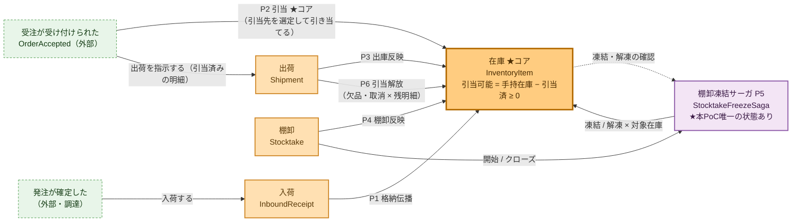
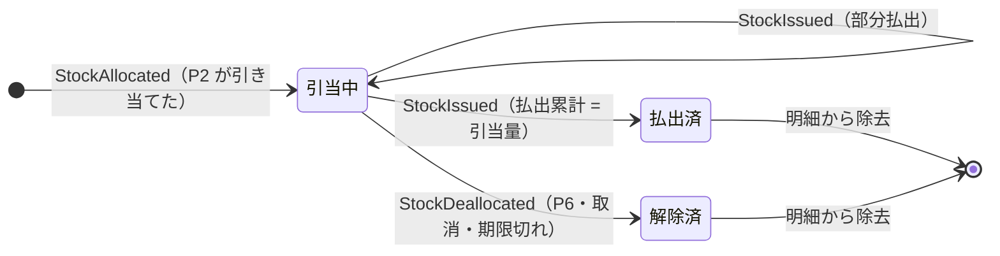
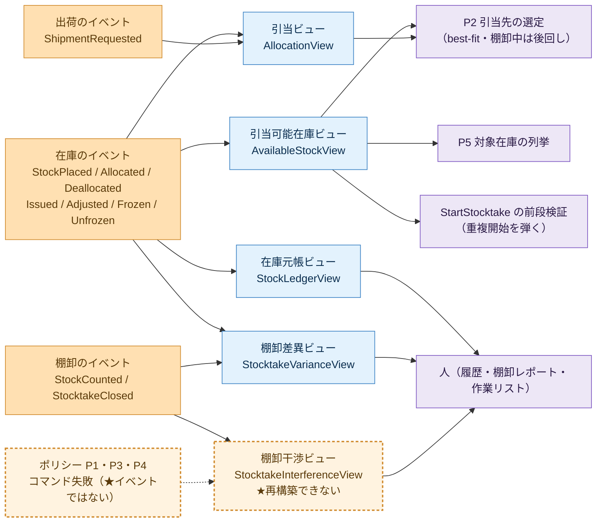

# 戦術設計（M2） — 倉庫在庫管理

> 前段: [`event-storming/`](event-storming/)（M1 戦略設計）。この文書の狙いは、分析で確定した集約・コマンド・
> イベント・不変条件を **型レベル（フィールド・シグネチャ・受付ゲート・例外）まで落とす**こと。実装（M3）は
> この文書を仕様として TDD で駆動する。用語の正は [`ubiquitous-language.md`](ubiquitous-language.md)、
> **決定の理由の正は [`decisions.md`](decisions.md)**（この文書は決定の*結果*だけを書く）。
>
> **進め方**: 集約ごとのスライスで確定していく。コア（在庫）→ 入荷 → 出荷 → 棚卸。
>
> | スライス | 状態 |
> |---|---|
> | ① 在庫（`InventoryItem`）★コア | **確定**（2026-08-03） |
> | ② 入荷（`InboundReceipt`） | **確定**（2026-08-05） |
> | ③ 出荷（`Shipment`） | **確定**（2026-08-09） |
> | ④ 棚卸（`Stocktake`） | **確定**（2026-08-09） |
> | ⑤ ポリシー P1〜P6 / リードモデル | **確定**（2026-08-12） |

## 表記の約束
- 主表現は日本語。英名はコード識別子として併記する（[`event-storming/00-method.md`](event-storming/00-method.md) の表記の約束に従う）。
- コードブロックは Java の `record` 前提（Java 25）。`@AggregateIdentifier` 等の Axon アノテーションは M3 実装時に付ける。
- 「受付ゲート」= `@CommandHandler` で判定し、違反時は**例外を投げてイベントを発行しない**（[`.claude/rules/aggregate-design.md`](../.claude/rules/aggregate-design.md)）。

---

## 全体像

**現在形の図**。[`event-storming/`](event-storming/) の図は **M1 時点の記録**で、後から決まったこと
（P6 の追加・出荷取消・入荷クローズ・リードモデルの顔ぶれ）が載っていないため、ここに現在形を置く。
BC 単位の関係は [`context-map.md`](context-map.md) が正。

### 俯瞰（集約とポリシーの結線）

まず1画面で構造を掴む図。**イベント名・コマンド名は次の[プロセス全体図](#プロセス全体図m2-現在形)が正**。



- **矢印はすべて「イベント → ポリシー → コマンド」**。BC をまたぐ直接依存はなく、1トランザクション1集約を守った
  結果整合の結線になっている（[H6](decisions.md#h6-受入在庫の集約帰属)）。
- **在庫（コア）が受け側に集中している**。入口（P1 計上）・出口（P3 払出）・訂正（P4 調整）・
  予約と解放（P2 / P6）がすべて在庫へ集まる形が、コアサブドメインの位置をそのまま表している。
- **点線は Saga への確認の戻り**（P5 だけが往復する）。ほかのポリシーは行きっぱなしで状態を持たない。
- **P2 と P5 はリードモデルを読む**（引当先の選定・対象の列挙）。その配線は[リードモデル](#リードモデル)の図を参照。

### プロセス全体図（M2 現在形）

[`event-storming/02-process.md`](event-storming/02-process.md) と**同じ粒度・同じ付箋の色**で描いた現在形。
M1 の図との差分は、**P6（引当解放）・出荷取消・入荷クローズ・リードモデルの顔ぶれ・
`StartStocktake` の前段検証**（M2 で決まったもの）。

```mermaid
flowchart TB
    %% 付箋の色 = イベントストーミング標準記法（正は event-storming/00-method.md）
    classDef evt   fill:#ffb366,stroke:#e07b1a,color:#3d2000;
    classDef cmd   fill:#7fbfe8,stroke:#2b7cb8,color:#062033;
    classDef actor fill:#ffe066,stroke:#c9a227,color:#3d3300;
    classDef pol   fill:#d9c2f0,stroke:#8b5cc4,color:#2e1650;
    classDef rm    fill:#a8e6a3,stroke:#3f9e3a,color:#0f2f0d;
    classDef ext   fill:#ffb3d1,stroke:#d1568f,color:#4a0f2b;

    %% ── 外部トリガ（↩）──
    X_PO["↩ 発注が確定した"]:::ext
    X_ORD["↩ 受注が受け付けられた<br/>(OrderAccepted)"]:::ext
    X_SHREQ["↩ 出荷を指示する<br/>(引当済みの明細)"]:::ext
    X_CANCEL["↩ 注文が取り消された / 期限切れ"]:::ext

    %% ── アクター（👤）──
    A_RCV["👤 入荷担当"]:::actor
    A_PUT["👤 格納担当"]:::actor
    A_PICK["👤 ピッキング担当"]:::actor
    A_SHIP["👤 出荷担当"]:::actor
    A_STK["👤 棚卸責任者"]:::actor
    A_CNT["👤 棚卸担当"]:::actor
    A_OPS["👤 在庫管理担当<br/>（干渉の二択・H22）"]:::actor

    %% ── リードモデル（📄）──
    RM_AVAIL["📄 引当可能在庫ビュー<br/>AvailableStockView"]:::rm
    RM_ALLOC["📄 引当ビュー<br/>AllocationView"]:::rm
    RM_VAR["📄 棚卸差異ビュー<br/>StocktakeVarianceView"]:::rm
    RM_INTF["📄 棚卸干渉ビュー<br/>StocktakeInterferenceView<br/>★再構築できない"]:::rm

    %% ── ポリシー（💜）──
    P1["💜 P1 格納伝播"]:::pol
    P2["💜 P2 引当 ★コア"]:::pol
    P3["💜 P3 出庫反映"]:::pol
    P4["💜 P4 棚卸反映"]:::pol
    P5["💜 P5 棚卸凍結<br/>Saga（唯一の状態あり）"]:::pol
    P6["💜 P6 引当解放"]:::pol

    %% ── コマンド（🟦）──
    C_RCV["入荷する<br/>(ReceiveStock)"]:::cmd
    C_PUT["格納する<br/>(PutAwayStock)"]:::cmd
    C_RCLOSE["入荷をクローズする<br/>(CloseInboundReceipt)"]:::cmd
    C_PLACE["在庫を計上する<br/>(PlaceStock)"]:::cmd
    C_ALLOC["引き当てる<br/>(AllocateStock)"]:::cmd
    C_DEALLOC["引当を解除する<br/>(DeallocateStock)"]:::cmd
    C_ISSUE["在庫を払い出す<br/>(IssueStock・払出累計)"]:::cmd
    C_ADJ["在庫を調整する<br/>(AdjustStock・実地値)"]:::cmd
    C_FREEZE["凍結する<br/>(FreezeStock)"]:::cmd
    C_UNFREEZE["解凍する<br/>(UnfreezeStock)"]:::cmd
    C_REQ["出荷を指示する<br/>(RequestShipment)"]:::cmd
    C_PICK["ピッキングする<br/>(PickStock)"]:::cmd
    C_SHIP["出荷する<br/>(ShipStock・完了区分)"]:::cmd
    C_CANCEL["出荷を取り消す<br/>(CancelShipment)"]:::cmd
    C_STK["棚卸を開始する<br/>(StartStocktake)"]:::cmd
    C_CNT["カウントする<br/>(CountStock)"]:::cmd
    C_CLOSE["棚卸をクローズする<br/>(CloseStocktake)"]:::cmd

    %% ── 集約（整合性境界）＝サブグラフ ──
    subgraph AG_RCV["🧺 入荷 InboundReceipt"]
      E_RCV["在庫が入荷された<br/>(StockReceived)"]:::evt
      E_PUT["在庫が格納された<br/>(StockPutAway)"]:::evt
      E_RCLOSE["入荷がクローズされた<br/>(InboundReceiptClosed)<br/>残量＋理由"]:::evt
    end
    subgraph AG_INV["📦 在庫 InventoryItem ★コア"]
      E_PLACE["在庫が計上された<br/>(StockPlaced)<br/>手持在庫↑"]:::evt
      E_ALLOC["在庫が引き当てられた<br/>(StockAllocated)"]:::evt
      E_DEALLOC["引当が解除された<br/>(StockDeallocated)"]:::evt
      E_ISSUE["在庫が払い出された<br/>(StockIssued)<br/>手持在庫↓・引当済↓"]:::evt
      E_ADJ["在庫が調整された<br/>(StockAdjusted)<br/>差分±・実地値"]:::evt
      E_FROZEN["在庫が凍結された<br/>(StockFrozen)"]:::evt
      E_UNFROZEN["在庫が解凍された<br/>(StockUnfrozen)"]:::evt
    end
    subgraph AG_SHIP["🚚 出荷 Shipment"]
      E_REQ["出荷が指示された<br/>(ShipmentRequested)"]:::evt
      E_PICK["在庫がピッキングされた<br/>(StockPicked)<br/>ピッキング累計"]:::evt
      E_SHIP["在庫が出荷された<br/>(StockShipped)<br/>出荷明細＋未出荷明細"]:::evt
      E_CANCEL["出荷が取り消された<br/>(ShipmentCancelled)<br/>取消明細＋理由"]:::evt
    end
    subgraph AG_STK["📋 棚卸 Stocktake（差異は持たない）"]
      E_STKSTART["棚卸が開始された<br/>(StocktakeStarted)"]:::evt
      E_CNT["実地数量がカウントされた<br/>(StockCounted)"]:::evt
      E_STKCLOSE["棚卸がクローズされた<br/>(StocktakeClosed)"]:::evt
    end

    %% ── 入荷〜格納 ──
    X_PO --> A_RCV --> C_RCV --> E_RCV
    E_RCV --> A_PUT --> C_PUT --> E_PUT
    E_PUT -. 残ゼロなら原子的に .-> E_RCLOSE
    A_PUT -. 破損・欠品で打ち切り .-> C_RCLOSE --> E_RCLOSE
    E_PUT --> P1 --> C_PLACE --> E_PLACE

    %% ── 引当（自動・コア）──
    X_ORD --> P2 --> C_ALLOC --> E_ALLOC
    RM_AVAIL -. 引当先を選定（best-fit） .-> P2
    RM_ALLOC -. 既存引当から再計画 .-> P2

    %% ── 出荷 ──
    X_SHREQ --> C_REQ --> E_REQ --> A_PICK
    A_PICK --> C_PICK --> E_PICK
    E_PICK --> P3 --> C_ISSUE --> E_ISSUE
    E_PICK --> A_SHIP --> C_SHIP --> E_SHIP
    X_CANCEL --> C_CANCEL --> E_CANCEL
    E_SHIP -. 欠品(SHORTAGE)の残明細 .-> P6
    E_CANCEL -. 全明細 .-> P6
    P6 --> C_DEALLOC --> E_DEALLOC

    %% ── 棚卸 ──
    RM_AVAIL -. 凍結中なら弾く（前段検証） .-> C_STK
    A_STK --> C_STK --> E_STKSTART
    E_STKSTART --> P5
    RM_AVAIL -. 対象在庫を列挙 .-> P5
    P5 --> C_FREEZE --> E_FROZEN
    E_FROZEN -. 凍結を確認 .-> P5
    E_STKSTART --> A_CNT --> C_CNT --> E_CNT
    RM_VAR -. 差異を見て数え直しを判断 .-> A_CNT
    E_CNT --> P4 --> C_ADJ --> E_ADJ
    A_STK --> C_CLOSE --> E_STKCLOSE --> P5
    P5 --> C_UNFREEZE --> E_UNFROZEN
    E_UNFROZEN -. 解凍を確認 .-> P5


    %% ── 凍結干渉（★イベントではない）──
    P1 -. コマンド失敗 .-> RM_INTF
    P3 -. コマンド失敗 .-> RM_INTF
    P4 -. コマンド失敗 .-> RM_INTF
    RM_INTF -. 再投入か破棄か .-> A_OPS

    %% ── 集約の枠 ＝「大きい淡黄の付箋」（整合性境界）──
    style AG_RCV fill:#fff9d6,stroke:#c9ad2e,stroke-width:2px,stroke-dasharray:5 4,color:#3d3300
    style AG_INV fill:#fff2a8,stroke:#c9ad2e,stroke-width:3px,stroke-dasharray:5 4,color:#3d3300
    style AG_SHIP fill:#fff9d6,stroke:#c9ad2e,stroke-width:2px,stroke-dasharray:5 4,color:#3d3300
    style AG_STK fill:#fff9d6,stroke:#c9ad2e,stroke-width:2px,stroke-dasharray:5 4,color:#3d3300
```



> 読み方（M1 と同じ）: **コマンド（青）の手前には必ず 👤/💜/↩ がある**＝「誰・何が決めたか」が見える。
> 枠（集約）をまたぐ自動連鎖は💜ポリシー経由（1トランザクション1集約）。

- **見やすさのため2つ省いている**。①**投影の線**（どのイベントがどのビューを更新するか）は
  [リードモデルの配線図](#配線何が書き誰が読むか)が正。②**在庫元帳ビュー**は工程に関与しない（人が履歴を読むだけ）。
- **📄 から出る点線＝判断の入力**。ポリシーがリードモデルを読むのは P2（引当先の選定・再計画）と
  P5（対象在庫の列挙）だけ。`StartStocktake` の前段検証（[H23](decisions.md#h23-棚卸の重複開始)）は
  **集約の受付ゲートではない**ので、コマンドの手前に点線で入っている。
- **棚卸干渉ビューだけ入口が💜ポリシー**（イベントではなく**コマンド失敗**を書く。
  [H22](decisions.md#h22-凍結中に拒否された在庫反映の行き先)）。人が再投入か破棄かを選び、
  **再投入は元のコマンドを人が改めて発行する**（保留キューを作らない）。
- **P5 だけイベントが戻ってくる**（凍結・解凍の確認）。ほかのポリシーは行きっぱなしで状態を持たない。

---

## 共通の値オブジェクト

原始型の乱用を避ける（[`.claude/rules/ddd-ubiquitous-language.md`](../.claude/rules/ddd-ubiquitous-language.md)）。

| 日本語 | 英名 | 中身 | 不変条件・振る舞い |
|---|---|---|---|
| SKU | `Sku` | 文字列 | 非空 |
| ロケーション | `LocationId` | 文字列 | 非空 |
| 在庫ID | `InventoryItemId` | `Sku` × `LocationId` | 複合。文字列化して集約識別子にする |
| 数量 | `Quantity` | 非負整数 | `≥ 0`。加算・減算（負になるなら例外）・比較・`ZERO` |
| 数量差分 | `QuantityDelta` | **符号付き**整数 | 棚卸調整の差分専用。増減の向きを持つ |
| 注文明細ID | `OrderLineId` | 文字列 | 非空。受注BC（外部）が振る。倉庫は採番しない |
| 引当ID | `AllocationId` | `OrderLineId` × `LocationId` | 引当1件を指す。**決定的に導出する**（採番しない。H26） |
| 入荷ID | `ReceiptId` | 文字列 | 非空 |
| 出荷ID | `ShipmentId` | 文字列 | 非空 |
| 棚卸ID | `StocktakeId` | 文字列 | 非空 |

```java
public record Quantity(int value) {
    public Quantity {
        if (value < 0) throw new IllegalArgumentException("数量は非負でなければならない: " + value);
    }
    public static final Quantity ZERO = new Quantity(0);
    public Quantity plus(Quantity other)  { return new Quantity(value + other.value); }
    public Quantity minus(Quantity other) { return new Quantity(value - other.value); } // 負なら例外
    public boolean isAtLeast(Quantity other) { return value >= other.value; }
    public boolean isZero() { return value == 0; }
}
```

> `Quantity` を非負に閉じるため、**引当可能（`available`）は `Quantity` で表さない**（H12 により負を取りうる）。
> 集約内では `int` の導出計算とし、判定は「引当可能 ≥ 要求量」の形でのみ行う。

### 集約識別子の表現（`InventoryItemId`）

在庫集約の識別子は `(Sku, LocationId)` の複合だが、Axon の `@AggregateIdentifier` は**単一の識別子**を要求する。
そこで複合を値オブジェクトに閉じ込め、**文字列化したものを集約識別子とする**。

```java
public record InventoryItemId(Sku sku, LocationId locationId) {
    public String asString() { return sku.value() + "@" + locationId.value(); } // 例: SKU-1234@A-01-03
    public static InventoryItemId parse(String s) { /* "@" で分割 */ }
}
```

- 分離子 `@` は `Sku` / `LocationId` に現れない前提を**値オブジェクトの検証で保証**する（含んでいたら生成時に例外）。
- リードモデルでは `sku` / `locationId` を**別カラムに分けて**持つ（SKU横断・ロケーション横断の検索が要るため）。文字列IDは結合キーとしてのみ使う。

---

## 集約① 在庫（`InventoryItem`）★コア

**責務**: SKU × ロケーション（棚1マス）の**残高と、それを守る約束**。
物そのものではなく「引当可能を負にしない」という約束の責任者。

### 状態

```
InventoryItem
  id          : InventoryItemId          // 集約識別子
  onHand      : Quantity                 // 手持在庫（物理的に手元にある数量）
  allocations : Map<AllocationId, Line>  // 引当明細
                Line { allocatedQty : Quantity     // 引当量（引当後は不変）
                       issuedQty    : Quantity }   // 払出累計
  frozen      : boolean                  // 凍結中（棚卸対象）
  frozenBy    : StocktakeId | null       // どの棚卸で凍結されたか

  // 導出値（フィールドに持たない）
  line.remaining = allocatedQty - issuedQty        // その引当の未払出残。★ 常に ≥ 0
  allocated      = Σ line.remaining
  available      = onHand - allocated              // ★ 負を取りうる（H12）
```

- **引当は明細で持つ**（合計だけではない）。理由: 解除・払出が「どの引当か」を指せないと、
  二重解除・引当量を超える払出・存在しない引当の解除を集約が拒否できないため。
  引当済（`allocated`）は明細の合計＝**導出値**。
- **明細は残量を減算せず、引当量と払出累計を積み上げる**。入荷の `putAwayQty`・出荷の `pickedQty` と同じ流儀。
  これにより `IssueStock` を**累計で受け取って冪等にできる**（[H30](decisions.md#h30-ポリシーの二重発火にどう備えるか)）。
  払い出しきった明細（`remaining == 0`）は除去するので、明細が無限に増えることはない。
- **`frozenBy` を持つ理由**: 解凍要求が「凍結した棚卸と同じか」を照合し、別の棚卸による誤解凍を防ぐため。

### 引当明細1件のライフサイクル

コアの状態そのもの。**引当は必ず閉じる**——消化（払出）か解放（解除）のどちらかで終わる（H17）。



- **`引当中 → 引当中` の自己ループが部分払出**（H15）。累計を積むので、同じ払出累計が再送されても
  ループは回らない＝冪等（[H30](decisions.md#h30-ポリシーの二重発火にどう備えるか)）。
- **終端で明細を除去する**ので、長寿命の在庫集約でも明細は増え続けない。
  除去後に届いた払出・解除は「未知の引当ID」として黙って無視される（H17・H30）。
- 引当済（`allocated`）に効くのは**引当中の明細だけ**（`Σ 未払出残`）。
  払出済・解除済はもう引当可能を押さえていない。
- この3状態が `AllocationView.status` の enum とそのまま対応する。

### 不変条件と、その強制点

| 不変条件 | 強制点 | 備考 |
|---|---|---|
| **引当可能 = 手持在庫 − 引当済 ≥ 0** | `AllocateStock` の受付ゲート（`引当可能 ≥ 要求量`） | コアの約束。**棚卸調整のみが例外的に負を持ち込む**（H12） |
| 手持在庫 ≥ 0 | `IssueStock` の受付ゲート（`手持在庫 ≥ 払出量`） | H12 の負状態では引当量の確認だけでは足りない（下記） |
| 引当明細の未払出残 ≥ 0 | `IssueStock` の受付ゲート | 引当量を超える払出を拒否 |
| 凍結中は物理を動かすコマンドを拒否 | `PlaceStock` / `IssueStock` の受付ゲート | 実地値を狂わせないため |

> **なぜ「状態として ≥ 0」ではなく「受付ゲート」なのか（H12）**
> 棚卸調整（`AdjustStock`）だけが引当可能を負にしうる唯一の経路で、この調整は必ず通す
> （例: 手持在庫50・引当済45 の棚を数えたら42 → 引当可能 −3）。負に落ちても新規引当は自動的に全部止まる。
> **判断の理由・却下した選択肢（拒否案／自動解除案）は [`decisions.md`](decisions.md#h12-実地値が引当済を下回る棚卸調整) を参照。**

### 凍結中（`frozen`）の受付可否

| コマンド | 凍結中 | 理由 |
|---|---|---|
| 在庫を計上する（`PlaceStock`） | **✕ 拒否** | 物理が動く＝実地値が狂う |
| 在庫を払い出す（`IssueStock`） | **✕ 拒否** | 物理が動く＝実地値が狂う |
| 引き当てる（`AllocateStock`） | ○ 通す | 物理は動かない（H11。露出は P2 が引当先を後回しにして下げる） |
| 引当を解除する（`DeallocateStock`） | ○ 通す | 物理は動かない |
| 在庫を調整する（`AdjustStock`） | ○ 通す | 棚卸のためのコマンドそのもの |
| 凍結する／解凍する | ○ 通す | 凍結制御そのもの（冪等） |

### コマンド → 受付ゲート → イベント → 状態遷移

#### 1. 在庫を計上する（`PlaceStock`）— 起点: ポリシー P1（格納伝播）

```java
record PlaceStock(InventoryItemId inventoryItemId, Quantity quantity, ReceiptId receiptId)
record StockPlaced(InventoryItemId inventoryItemId, Quantity quantity, ReceiptId receiptId)
```

| 受付ゲート（拒否条件） | 例外 |
|---|---|
| 数量がゼロ | `InvalidQuantityException` |
| 凍結中 | `InventoryFrozenException` |

- **集約の誕生**: `@CreationPolicy(CREATE_IF_MISSING)`。その棚マスに初めて物が入った瞬間に集約が生まれる
  （分析の「格納で誕生」に忠実。棚マスタ登録という概念をドメインに増やさない）。
- 状態遷移: `onHand += quantity`

#### 2. 引き当てる（`AllocateStock`）— 起点: ポリシー P2（引当）★コア

```java
record AllocateStock(InventoryItemId inventoryItemId, AllocationId allocationId, Quantity quantity)
record StockAllocated(InventoryItemId inventoryItemId, AllocationId allocationId, Quantity quantity)
```

| 受付ゲート（拒否条件） | 例外 |
|---|---|
| 数量がゼロ | `InvalidQuantityException` |
| 引当IDが既知 **かつ数量が違う**（矛盾する要求） | `DuplicateAllocationException` |
| **引当可能 < 要求量** | **`InsufficientAvailableStockException`** ← コアの不変条件 |

| 冪等の扱い | 挙動 |
|---|---|
| 引当IDが既知 **かつ数量が同じ** | **イベントを発行しない**（黙って無視）。例外も投げない |

- 凍結中でも**通す**（H11）。
- **条件付きで冪等にする理由（H26）**: 発行元の P2（引当）が計画を立て直して**再送しうる**ため。
  基準は `DeallocateStock` と同じ——「同じ結果になる要求は黙って受け入れ、矛盾する要求は拒否する」。
  数量違いを拒否すると再処理が起き、引当ビューが追いつくまで繰り返される＝**自己修正する**。
  → [`decisions.md`](decisions.md#h26-引当が途中で失敗したときの立て直し)
- 状態遷移: `allocations.put(allocationId, Line(allocatedQty = quantity, issuedQty = ZERO))`

#### 3. 引当を解除する（`DeallocateStock`）— 起点: 取消・期限切れ

```java
record DeallocateStock(InventoryItemId inventoryItemId, AllocationId allocationId, DeallocationReason reason)
record StockDeallocated(InventoryItemId inventoryItemId, AllocationId allocationId,
                        Quantity quantity, DeallocationReason reason)
enum DeallocationReason { ORDER_CANCELLED, EXPIRED, SHORT_SHIPPED }   // 注文取消 / 期限切れ / 欠品出荷
```

| コマンド | 挙動 |
|---|---|
| `DeallocateStock` | 引当IDが未知なら**イベントを発行しない**（冪等）。例外は投げない |

- **全量解除に限る**（部分解除の要求はない。必要になれば M3+ で足す）。イベントには解除された数量
  ＝**未払出残**を載せる（一部を払い出した引当を解除すれば、戻るのは残りだけ）。
  リードモデルがイベント単独で更新できるように載せる＝プロジェクションが集約の状態を引かない。
- **冪等にする理由（H17）**: 発行元に**ポリシー P6（引当解放）**が加わり、再送・リプレイでの重複送信がありうるため。
  凍結・解凍と同じ基準（「同じ結果になる要求は黙って受け入れる」）。「既に解除済み」と「そもそも存在しない」は
  集約から区別できない。→ [`decisions.md`](decisions.md#h17-宙に浮いた引当を誰が解放するか)
- `SHORT_SHIPPED` は P6 が出荷側の `SHORTAGE` を写像したもの（③出荷スライス）。
- 凍結中でも通す。
- 状態遷移: `allocations.remove(allocationId)`

#### 4. 在庫を払い出す（`IssueStock`）— 起点: ポリシー P3（出庫反映）

```java
record IssueStock(InventoryItemId inventoryItemId, AllocationId allocationId, Quantity issuedTotal)
record StockIssued(InventoryItemId inventoryItemId, AllocationId allocationId,
                   Quantity quantity, Quantity issuedTotal)   // quantity = 今回適用した差分
```

**払出量（`quantity`）は集約が出す差分**であって、コマンドは**払出累計（`issuedTotal`）を絶対値で渡す**。
`差分 = issuedTotal − 明細の払出累計`。

| 受付ゲート（拒否条件） | 例外 |
|---|---|
| 凍結中 | `InventoryFrozenException` |
| 差分 > その引当の未払出残 | `IssueExceedsAllocationException` |
| **差分 > 手持在庫** | **`InsufficientOnHandException`** ← H12 の帰結 |

| 冪等の扱い | 挙動 |
|---|---|
| 引当IDが未知（払い出しきって明細が消えた／そもそも無い） | **イベントを発行しない**。例外も投げない |
| 差分がゼロ以下（同じ累計の再送・古い累計の再送） | **イベントを発行しない**。例外も投げない |

- **部分払出を許す**（ピッキングで一部しか取れないことは現実に起きる）。残りは引当のまま。
- **累計で受け取る理由（H30）**: 発行元の P3（出庫反映）は at-least-once の配信を受けるため、
  同じ `StockPicked` を2回処理しうる。増分を送ると二重に減るが、累計なら再送は差分ゼロで消える。
  `AdjustStock` が実地値を絶対値で渡すのと同じ流儀（H10）。
- **未知の引当IDで例外を投げない理由（H30）**: 「既に払い出し済み」と「そもそも存在しない」は集約から
  区別できない。`DeallocateStock` が同じ理由で冪等にしてある（H17）のと揃える。
  → [`decisions.md`](decisions.md#h30-ポリシーの二重発火にどう備えるか)
- **最後のゲートが要る理由（H12）**: 通常は 引当済 ≤ 手持在庫 なので引当量の確認だけで足りるが、
  棚卸調整で引当可能が負に落ちた状態では 引当済 > 手持在庫 となり、引当量の範囲内でも手持在庫を負にしうる。
- 状態遷移: `onHand -= 差分`／`line.issuedQty = issuedTotal`（未払出残がゼロになったら明細から除去）。
  **手持在庫と引当済が同額ずつ減るので引当可能は不変**（H7）。

#### 5. 在庫を調整する（`AdjustStock`）— 起点: ポリシー P4（棚卸反映）

```java
record AdjustStock(InventoryItemId inventoryItemId, Quantity countedQuantity, StocktakeId stocktakeId)
record StockAdjusted(InventoryItemId inventoryItemId, QuantityDelta delta,
                     Quantity countedQuantity, StocktakeId stocktakeId)
```

| 受付ゲート（拒否条件） | 例外 |
|---|---|
| 別の棚卸が凍結中（`凍結中 かつ frozenBy ≠ stocktakeId`） | `NotFrozenByThisStocktakeException` |

- **数量については拒否条件を持たない**のがこのコマンドの特徴。凍結中でも通し、引当可能が負になっても通す。
- 拒否するのは**呼び出し元の正当性**のみ（他の棚卸が凍結中の棚＝同じ棚を2つの棚卸が同時に触っている）。
  **凍結されていない場合は通す**（凍結漏れを理由に数えた事実を捨てない）。
- 理由は [`decisions.md`](decisions.md#h12-実地値が引当済を下回る棚卸調整)（H12）と
  [`decisions.md`](decisions.md#h11-棚卸中の引当をどこまで許すか)（H11「既知のリスク」＝凍結漏れの許容）。
- `delta = 実地値 − 手持在庫`（符号付き）。**差分ゼロならイベントを発行しない**
  （何も起きていないため。「数えた」という事実は棚卸集約の `StockCounted` に残るので情報は失われない）。
- イベントは**符号付き差分＋実地値＋原因**を持つ（H10）。過去イベントを書き換えない**補正**イベント。
  帳簿値は `実地値 − 差分` で復元できる。
- 状態遷移: `onHand = countedQuantity`

#### 6-7. 凍結する／解凍する（`FreezeStock` / `UnfreezeStock`）— 起点: サーガ P5

```java
record FreezeStock(InventoryItemId inventoryItemId, StocktakeId stocktakeId)
record StockFrozen(InventoryItemId inventoryItemId, StocktakeId stocktakeId)

record UnfreezeStock(InventoryItemId inventoryItemId, StocktakeId stocktakeId)
record StockUnfrozen(InventoryItemId inventoryItemId, StocktakeId stocktakeId)
```

| コマンド | 挙動 |
|---|---|
| `FreezeStock` | 既に同じ棚卸で凍結中なら**イベントを発行しない**（冪等）。別の棚卸で凍結中なら `AlreadyFrozenException` |
| `UnfreezeStock` | 凍結中でなければ**イベントを発行しない**（冪等）。凍結した棚卸と違えば `NotFrozenByThisStocktakeException` |

- **冪等にする理由**: 発行元が Saga（P5）であり、再送・再起動での重複送信がありうるため。
  「同じ結果になる要求は黙って受け入れ、矛盾する要求は拒否する」で分ける。

### 例外一覧

| 例外 | 意味 |
|---|---|
| `InsufficientAvailableStockException` | 引当可能 < 要求量。**コアの不変条件違反** |
| `InsufficientOnHandException` | 払出量 > 手持在庫（H12 の負状態でのみ到達） |
| `IssueExceedsAllocationException` | 払出の差分 > その引当の未払出残 |
| `DuplicateAllocationException` | 同じ引当IDで**数量が違う**引当（同じ数量なら冪等に無視。H26） |
| `InventoryFrozenException` | 凍結中に物理を動かすコマンド（計上・払出） |
| `AlreadyFrozenException` / `NotFrozenByThisStocktakeException` | 別の棚卸による凍結・解凍・調整（棚の取り合い） |
| `InvalidQuantityException` | 数量ゼロ等、事実として成立しない数量 |

### テスト骨子（Axon `AggregateTestFixture` / Given-When-Then）

M3 で**先に書いて赤にする**（[`.claude/rules/testing.md`](../.claude/rules/testing.md)）。ドメインの言葉で書く。

**正常系**
1. 空の棚に在庫を計上すると、在庫が計上され手持在庫が増える（集約が誕生する）
2. 引当可能の範囲で引き当てられる
3. 引当を解除すると引当可能が戻る
4. 払い出すと手持在庫と引当済が同額ずつ減り、**引当可能は変わらない**
5. 一部だけ払い出すと、残りは引当のまま残る（累計を渡すと差分だけが適用される）
6. 実地値が帳簿値を下回ると、符号付き差分を持つ調整イベントが出て手持在庫が実情に合う

**不変条件（異常系・`expectException` でイベントを発行しないこと）**
7. 引当可能を超える引当は拒否される ★コア
8. 同じ引当IDで**数量が違う**引当は拒否される（矛盾する要求。H26）
9. **未知の引当IDの払出はイベントを発行しない**（冪等。H30）
10. **未知の引当IDの解除はイベントを発行しない**（冪等。H17）
11. **同じ引当IDで同じ数量の引当はイベントを発行しない**（冪等。H26）
12. **同じ払出累計の再送はイベントを発行しない**（冪等。H30）★二重発火対策
13. **古い払出累計の再送はイベントを発行しない**（差分が負。H30）
14. 引当量を超える払出は拒否される
15. **手持在庫を超える払出は拒否される**（H12 の帰結）
16. 数量ゼロの計上・引当は拒否される

**凍結（P5）**
17. 凍結中の計上は拒否される
18. 凍結中の払出は拒否される
19. **凍結中でも引当は通る**（H11）
20. 同じ棚卸での二重凍結はイベントを発行しない（冪等）
21. 別の棚卸が凍結中の在庫への凍結要求は拒否される
22. 凍結した棚卸と異なる棚卸からの解凍要求は拒否される
23. 凍結中でない在庫への解凍要求はイベントを発行しない（冪等）

**境界・H12**
24. 差分ゼロの調整はイベントを発行しない
25. 実地値が帳簿値を上回る調整では、正の差分を持つ調整イベントが出る
26. **実地値が引当済を下回っても調整は通り、以降の新規引当がすべて拒否される**（H12）
27. 別の棚卸が凍結中の在庫への調整は拒否される
28. 凍結されていない在庫への調整は通る（凍結漏れがあっても数えた事実は捨てない）

---

## 集約② 入荷（`InboundReceipt`）

**責務**: 受入ドックに置かれた**1SKU の物のかたまり**と、それを守る約束。
「受け入れた量より多くを棚に上げない」（格納累計 ≤ 受入量）の責任者。
在庫と違い**引当には関与しない**（ロケーション未確定の在庫は引けない＝ H3 / H6）。

- 検品は独立させず受入〜格納に**内包**する（H8）。`InspectStock` / `StockInspected` は作らない。
- **1入荷 = 1SKU**。`ReceiptId` は伝票番号ではなく**ドックに置かれた物のかたまりの識別子**
  （H13 の帰結。ユニットは代替可能なので、かたまりを分ける軸は SKU だけでよい）。

### 状態

```
InboundReceipt
  id          : ReceiptId       // 集約識別子
  sku         : Sku             // 1入荷 = 1SKU
  receivedQty : Quantity        // 受入量（受入後は不変）
  putAwayQty  : Quantity        // 格納累計
  closed      : boolean         // クローズ済み（H14）
  closureReason : ClosureReason | null

  // 導出値（フィールドに持たない）
  remaining = receivedQty - putAwayQty   // 残格納量。★ 常に ≥ 0
```

- **残格納量を持たず格納累計を持つ**理由: 在庫側で引当済を明細の合計＝導出値にしたのと同じ流儀
  （積み上げた事実を保持し、残りは引き算で出す）。イベント単独でリードモデルも更新できる。
- **残格納量は `Quantity`（非負）で表せる**。在庫の引当可能（負を取りうる／H12）との違いは、
  **負を持ち込む経路がここには無い**こと。棚卸調整に相当する「外から実情を上書きする入力」が入荷には無く、
  変化はすべて自分の受付ゲートを通った格納だけで起きる。

### 不変条件と、その強制点

| 不変条件 | 強制点 | 備考 |
|---|---|---|
| **格納累計 ≤ 受入量**（残格納量 ≥ 0） | `PutAwayStock` の受付ゲート（`残格納量 ≥ 格納量`） | 受け入れた以上を棚に上げない |
| クローズ後は格納しない | `PutAwayStock` の受付ゲート | 終わった入荷は動かない（H14） |
| 受入量は受入後に変わらない | 変更コマンドを持たない | 訂正が要るなら打ち切って入荷し直す |

### コマンド → 受付ゲート → イベント → 状態遷移

#### 1. 入荷する（`ReceiveStock`）— 起点: 外部トリガ（調達 / Procurement）

```java
record ReceiveStock(ReceiptId receiptId, Sku sku, Quantity quantity)
record StockReceived(ReceiptId receiptId, Sku sku, Quantity quantity)
```

| 受付ゲート（拒否条件） | 例外 |
|---|---|
| 数量がゼロ | `InvalidQuantityException` |

- **集約の誕生**: コンストラクタコマンド（在庫の `@CreationPolicy(CREATE_IF_MISSING)` とは異なる）。
  入荷は `ReceiptId` を**外から与えられて1回だけ生まれる**ため、同一IDの二重受入はイベントストアの
  一意性制約で拒否される（Axon が集約ストリーム作成時に例外）。在庫が「その棚マスに初めて物が入った瞬間に
  生まれる」のと対照的で、**識別子の出所が違えば誕生の作り方も違う**。
- 状態遷移: `receivedQty = quantity`／`putAwayQty = ZERO`／`closed = false`

#### 2. 格納する（`PutAwayStock`）— 起点: 倉庫作業者

```java
record PutAwayStock(ReceiptId receiptId, LocationId locationId, Quantity quantity)
record StockPutAway(ReceiptId receiptId, Sku sku, LocationId locationId, Quantity quantity)
```

| 受付ゲート（拒否条件） | 例外 |
|---|---|
| 数量がゼロ | `InvalidQuantityException` |
| クローズ済み | `ReceiptAlreadyClosedException` |
| **格納量 > 残格納量** | **`PutAwayExceedsRemainingException`** ← 不変条件 |

- **分割格納を許す**（1入荷を複数ロケーションへ分けて置くのは現実に起きる）。ロケーションは**格納時に確定**する。
- イベントに `sku` を載せるのは、**ポリシー P1 が入荷集約を引かずに `PlaceStock` を組み立てられる**ようにするため
  （在庫の識別子は `(Sku, LocationId)`）。プロジェクションが集約の状態を引かないのと同じ理由。
- **残格納量がゼロになったら、続けて `InboundReceiptClosed(残量0, COMPLETED)` を原子的に発行する**（H14）。
- 状態遷移: `putAwayQty += quantity`（残ゼロならクローズ）

#### 3. 入荷をクローズする（`CloseInboundReceipt`）— 起点: 倉庫作業者（破損・欠品）

```java
record CloseInboundReceipt(ReceiptId receiptId, ClosureReason reason)
record InboundReceiptClosed(ReceiptId receiptId, Quantity remainingQuantity, ClosureReason reason)
enum ClosureReason { COMPLETED, DAMAGED, SHORTAGE }   // 全量格納 / 破損 / 欠品
```

| 受付ゲート（拒否条件） | 例外 |
|---|---|
| クローズ済み（二重打ち切り） | `ReceiptAlreadyClosedException` |
| 理由が `COMPLETED`（全量格納は自動発行のみ） | `InvalidClosureReasonException` |

- **残格納量が残っていても通す**。破損・欠品という現実を**残量と理由として記録して**終わらせる
  （隠さない＝在庫側 H10 / H12 と同じ姿勢）。**判断の理由・却下した選択肢は
  [`decisions.md`](decisions.md#h14-格納しきれなかった入荷の終わらせ方) を参照。**
- **冪等にしない**（凍結・解凍とは逆）。発行元が人間のアクターであり、二重打ち切りは誤操作として伝えるべきため。
- 状態遷移: `closed = true`／`closureReason = reason`

### 例外一覧

| 例外 | 意味 |
|---|---|
| `PutAwayExceedsRemainingException` | 格納量 > 残格納量。**入荷の不変条件違反** |
| `ReceiptAlreadyClosedException` | クローズ済みの入荷への格納・再クローズ |
| `InvalidClosureReasonException` | `COMPLETED` を指定した打ち切り要求（全量格納は自動発行のみ） |
| `InvalidQuantityException` | 数量ゼロ（在庫スライスと共有） |

### 在庫集約との接続（ポリシー P1）

`StockPutAway` → **P1（格納伝播）** → `PlaceStock(InventoryItemId(sku, locationId), quantity, receiptId)`。
1トランザクション1集約のため**結果整合**（H6）。

> **片落ち（決着済み）**: 格納先の在庫が**凍結中**だと `PlaceStock` は拒否され
> （`InventoryFrozenException`）、入荷側は格納済みなのに在庫に反映されない**片落ち**が残る。
> **棚卸干渉ビューに積んで人が再投入／破棄を選ぶ**（[H22](decisions.md#h22-凍結中に拒否された在庫反映の行き先)）。
> 扱いは[ポリシー P1・P3・P4](#ポリシー-p1p3p4単発伝播) の節を参照。

### テスト骨子（Axon `AggregateTestFixture` / Given-When-Then）

**正常系**
1. 入荷すると入荷が生まれ、残格納量が受入量と等しくなる
2. 一部を格納すると残格納量が減る
3. 複数のロケーションへ分割して格納できる
4. 全量を格納すると、格納イベントに続けて**完了としてクローズされる**（`COMPLETED`・残量ゼロ）

**不変条件（異常系・`expectException` でイベントを発行しないこと）**
5. 残格納量を超える格納は拒否される ★不変条件
6. 受入量ゼロの入荷は拒否される
7. 数量ゼロの格納は拒否される
8. クローズ済みの入荷への格納は拒否される

**クローズ（H14）**
9. 残格納量を残したまま破損で打ち切ると、**残量と理由を持つ**クローズイベントが出る
10. 欠品で打ち切っても同様に残量が記録される
11. クローズ済みの入荷の二重打ち切りは拒否される（冪等にしない）
12. `COMPLETED` を指定した打ち切り要求は拒否される

---

## 集約③ 出荷（`Shipment`）

**責務**: 1注文ぶんの**引当を消化して倉庫の外へ出す工程**と、それを守る約束。
「引き当てた以上を棚から取らない」（ピッキング累計 ≤ 引当量）の責任者。
在庫の残高そのものは持たず、**減らすのは在庫集約**（ポリシー P3 経由。H7）。

- **出荷は複数SKUを持つ**。入荷が1SKU（H13）なのと非対称だが、かたまりを分ける軸が
  **入荷＝SKU／出荷＝顧客（注文）** と違うだけで、矛盾ではない（H9 = 注文単位）。
- 出荷指示は上流からの**薄い外部トリガ**。明細は**引当済みのもの**として渡される
  （引当は先に P2 が済ませている）。

### 状態

```
Shipment
  id        : ShipmentId                 // 集約識別子
  lines     : Map<AllocationId, Line>    // 出荷明細（引当1件 = 明細1件）
              Line { inventoryItemId : InventoryItemId
                     allocatedQty    : Quantity     // 引当量（指示後は不変）
                     pickedQty       : Quantity }   // ピッキング累計
  shipped   : boolean                    // 出荷済み（終端）
  cancelled : boolean                    // 取消済み（終端）

  // 導出値（フィールドに持たない）
  line.remaining   = allocatedQty - pickedQty      // 未ピッキング残。★ 常に ≥ 0
  fullyPicked      = 全 line で remaining == 0
  pickedTotal      = Σ pickedQty                   // 棚から取った総量
  finished         = shipped || cancelled
```

- **残量を持たず累計を持つ**のは入荷（`putAwayQty`）と同じ流儀。これにより
  「一部だけ取る → 補充を待つ → 残りを取る」が**追加の仕組みなしで**表せる（H15）。
- **進捗（指示済／ピッキング中／出荷済）を enum で持たない**。すべて上の導出値で読める。
  分析時に想定していた `ShipmentStatus` は不採用（H15 の帰結）。
- **終端が2つある**理由: 出荷と取消は「物が倉庫を出たか出ていないか」という別の事実であり、
  入荷のようには1イベントに束ねられない（H16）。

### 不変条件と、その強制点

| 不変条件 | 強制点 | 備考 |
|---|---|---|
| **ピッキング累計 ≤ 引当量**（未ピッキング残 ≥ 0） | `PickStock` の受付ゲート（`未ピッキング残 ≥ ピック量`） | 引き当てた以上を棚から取らない |
| 終端後は動かない | `PickStock` / `ShipStock` / `CancelShipment` の受付ゲート | 出荷済み・取消済みの出荷は不変 |
| 何も取っていない出荷は出荷できない | `ShipStock` の受付ゲート（`pickedTotal > 0`） | 0個出荷は事実として成立しない（H16） |
| ピッキング済みの出荷は取り消せない | `CancelShipment` の受付ゲート | 棚へ戻す工程が別に要る（本PoC範囲外） |
| 明細は指示後に変わらない | 変更コマンドを持たない | 訂正が要るなら取り消して指示し直す |

### コマンド → 受付ゲート → イベント → 状態遷移

#### 1. 出荷を指示する（`RequestShipment`）— 起点: 外部トリガ（受注 / Ordering）

```java
record ShipmentLine(AllocationId allocationId, InventoryItemId inventoryItemId, Quantity quantity)

record RequestShipment(ShipmentId shipmentId, List<ShipmentLine> lines)
record ShipmentRequested(ShipmentId shipmentId, List<ShipmentLine> lines)
```

| 受付ゲート（拒否条件） | 例外 |
|---|---|
| 明細が空 | `EmptyShipmentException` |
| 同じ引当IDが明細に重複 | `DuplicateShipmentLineException` |
| 数量ゼロの明細を含む | `InvalidQuantityException` |

- **明細はコマンドに載せて渡す**。集約が引当ビュー（`AllocationView`）を引くことはしない
  （[`.claude/rules/cqrs-projection.md`](../.claude/rules/cqrs-projection.md)。引当先の選定は P2 の責務で、
  ここに来る時点で `(AllocationId, InventoryItemId, 数量)` は確定している）。
- **集約の誕生**: コンストラクタコマンド（入荷と同じく `ShipmentId` を外から与えられて1回だけ生まれる）。
  同一IDの二重指示はイベントストアの一意性制約で拒否される。
- 状態遷移: 各明細を `allocatedQty = quantity` / `pickedQty = ZERO` で登録。`shipped = cancelled = false`

#### 2. ピッキングする（`PickStock`）— 起点: 倉庫作業者（ピッキング担当）

```java
record PickStock(ShipmentId shipmentId, AllocationId allocationId, Quantity quantity)
record StockPicked(ShipmentId shipmentId, AllocationId allocationId,
                   InventoryItemId inventoryItemId, Quantity quantity, Quantity pickedTotal)
```

| 受付ゲート（拒否条件） | 例外 |
|---|---|
| 数量がゼロ | `InvalidQuantityException` |
| 出荷済み／取消済み | `ShipmentFinishedException` |
| 引当IDが明細に無い | `UnknownShipmentLineException` |
| **ピック量 > 未ピッキング残** | **`PickExceedsAllocationException`** ← 不変条件 |

- **部分ピッキングを許す**。棚に引当量ぶんの現物がないのは H12 と同根の事故で低頻度だが、
  そのために作業を止めない。残りは後から取れる（同じコマンドを再度送る）。
  **判断の理由・却下した選択肢（Nothing or All 案／一括ピッキング案）は
  [`decisions.md`](decisions.md#h15-ピッキングの完了条件) を参照。**
- **明細1件（引当1件）単位**。まとめて送らないので、P3 は `StockPicked` 1件 → `IssueStock` 1件の
  単発伝播のままでいられる（P1 と対称）。
- イベントに `inventoryItemId` を載せるのは、**P3 が出荷集約を引かずに `IssueStock` を組み立てられる**ようにするため
  （P1 が `StockPutAway` に `sku` を載せたのと同じ理由）。
- **`pickedTotal`（ピッキング累計）も載せる**。P3 はこれをそのまま `IssueStock` に渡し、在庫集約が差分を出す。
  イベントが二重配信されても累計は同じ値なので、在庫が二重に減らない
  （[H30](decisions.md#h30-ポリシーの二重発火にどう備えるか)）。集約が既に持っている値を渡すだけで、新しい状態は要らない。
- 状態遷移: `line.pickedQty += quantity`

#### 3. 出荷する（`ShipStock`）— 起点: 倉庫作業者（出荷担当）

```java
record ShipStock(ShipmentId shipmentId, ShipmentCompletion completion)
record StockShipped(ShipmentId shipmentId, List<ShipmentLine> shippedLines,
                    List<ShipmentLine> unshippedLines, ShipmentCompletion completion)
enum ShipmentCompletion { COMPLETE, SHORTAGE }   // 全量出荷 / 欠品を残して完了
```

| 受付ゲート（拒否条件） | 例外 |
|---|---|
| 出荷済み／取消済み | `ShipmentFinishedException` |
| 1件もピッキングしていない（`pickedTotal == 0`） | `NothingPickedException` |
| 未ピッキング残あり かつ `COMPLETE` | `ShipmentNotFullyPickedException` |
| 未ピッキング残なし かつ `SHORTAGE` | `InvalidCompletionException` |

- **残高は動かさない**。手持在庫・引当済はピッキング時に確定済み（H7）。このイベントは
  「物が倉庫を出た」という事実だけを表す。
- **欠品を残したまま完了できる**。ただし人が `SHORTAGE` を**明示**する（H16）。
  「部分でよいか全量必要か」を決めるのは顧客（上流）であり、集約は許すだけで決めない。
  全量必要なら**このコマンドを打たずに**補充を待ち、残りをピッキングしてから `COMPLETE` で打つ。
- **`COMPLETE` をコマンドで指定できる**のは入荷（`COMPLETED` は自動発行専用 / H14）と**逆**。
  出荷は残ゼロでも「これで終わりにする」という人の意思が入るため。
  → [`decisions.md`](decisions.md#h16-欠品したまま終わる出荷の終わらせ方)
- `shippedLines` / `unshippedLines` を載せる理由: 下流（リードモデル・**P6**）が
  出荷集約を引かずに処理できるようにするため。
- 状態遷移: `shipped = true`

#### 4. 出荷を取り消す（`CancelShipment`）— 起点: 外部トリガ（注文取消）・タイマー（期限切れ）

```java
record CancelShipment(ShipmentId shipmentId, CancellationReason reason)
record ShipmentCancelled(ShipmentId shipmentId, List<ShipmentLine> cancelledLines,
                         CancellationReason reason)
enum CancellationReason { ORDER_CANCELLED, EXPIRED }   // 注文取消 / 期限切れ
```

| 受付ゲート（拒否条件） | 例外 |
|---|---|
| 出荷済み／取消済み | `ShipmentFinishedException` |
| **1件でもピッキング済み**（`pickedTotal > 0`） | **`AlreadyPickedException`** ← 不変条件 |

- **ピッキング前に限る**。既に棚から取っていたら、物を棚へ戻す工程（`StockReturned` 相当）が要るが、
  これは H5（ロケーション間の在庫移動）と同型の未導入概念なので**M3+ の改修シナリオ候補**へ送る。
  現時点では「取れる分を出荷して `SHORTAGE` で閉じる」経路がある。
- `cancelledLines` は**全明細**（まだ1件も消化していないため）。P6 がこれを見て引当を解放する。
- 状態遷移: `cancelled = true`

### 例外一覧

| 例外 | 意味 |
|---|---|
| `PickExceedsAllocationException` | ピック量 > 未ピッキング残。**出荷の不変条件違反** |
| `AlreadyPickedException` | ピッキング済みの出荷への取消要求 |
| `ShipmentFinishedException` | 終端（出荷済み・取消済み）の出荷への操作 |
| `NothingPickedException` | 1件もピッキングしていない出荷の出荷要求（0個出荷） |
| `ShipmentNotFullyPickedException` | 未ピッキング残があるのに `COMPLETE` を指定 |
| `InvalidCompletionException` | 未ピッキング残が無いのに `SHORTAGE` を指定 |
| `UnknownShipmentLineException` | 明細に無い引当IDへのピッキング |
| `EmptyShipmentException` / `DuplicateShipmentLineException` | 空の明細／引当IDの重複した出荷指示 |
| `InvalidQuantityException` | 数量ゼロ（在庫・入荷スライスと共有） |

### 在庫集約との接続（ポリシー P3 / P6）

```
StockPicked                  → P3（出庫反映）  → IssueStock(inventoryItemId, allocationId, pickedTotal)
StockShipped(未出荷残あり)    → P6（引当解放）  → DeallocateStock(..., SHORT_SHIPPED)   × 残明細
ShipmentCancelled            → P6（引当解放）  → DeallocateStock(..., 取消理由を写像)   × 全明細
```

**P6 は出荷スライスで新規に見つかったポリシー**（H17）。放置すると在庫側の引当済が減らず
**引当可能が永久に目減りする**ため必要になった。P6 は残明細の数だけコマンドを送る **1:N** だが、
**状態を持たないので Saga ではない**（P5 との違いは fan-out の有無ではなく途中状態の有無）。
BC 間の語彙の写像（`SHORTAGE` → `SHORT_SHIPPED` 等）も P6 が担う。

> **片落ち（決着済み）**: ピッキング先の在庫が**凍結中**だと `IssueStock` は拒否され
> （`InventoryFrozenException`）、出荷側は棚から取っているのに在庫が減らない**片落ち**が残る。
> **P1（格納伝播）の片落ちと完全に同型**（入口と出口で対称に発生する）なので、受け皿も同じ
> ——棚卸干渉ビュー（[H22](decisions.md#h22-凍結中に拒否された在庫反映の行き先)）。
> 扱いは[ポリシー P1・P3・P4](#ポリシー-p1p3p4単発伝播) の節を参照。

### テスト骨子（Axon `AggregateTestFixture` / Given-When-Then）

**正常系**
1. 出荷を指示すると出荷が生まれ、各明細の未ピッキング残が引当量と等しくなる
2. 全量をピッキングして出荷すると、全明細が出荷済みで完了する（`COMPLETE`・未出荷残なし）
3. 明細ごとに分けてピッキングできる（複数SKU）

**不変条件（異常系・`expectException` でイベントを発行しないこと）**
4. 未ピッキング残を超えるピッキングは拒否される ★不変条件
5. 明細に無い引当IDへのピッキングは拒否される
6. 数量ゼロのピッキングは拒否される
7. 空の明細での出荷指示は拒否される
8. 同じ引当IDを重複して含む出荷指示は拒否される
9. 出荷済み・取消済みの出荷へのピッキングは拒否される

**部分ピッキング（H15）**
10. 引当量に満たないピッキングが通り、未ピッキング残が残る
11. **残りを後からピッキングすると全量ピッキング済みになる**（補充を待つ経路）
12. 部分ピッキングのまま `COMPLETE` で出荷しようとすると拒否される

**欠品での完了・取消（H16）**
13. 未ピッキング残を残したまま `SHORTAGE` で出荷すると、**出荷明細と未出荷明細を持つ**イベントが出る
14. 未ピッキング残が無いのに `SHORTAGE` を指定すると拒否される
15. 1件もピッキングせずに出荷しようとすると拒否される
16. ピッキング前なら出荷を取り消せ、**全明細が取消明細として**イベントに乗る
17. 1件でもピッキング済みなら取消は拒否される ★不変条件
18. 取消済みの出荷の二重取消は拒否される

---

## 集約④ 棚卸（`Stocktake`）

**責務**: 対象の棚を回って**実地数量を数え、実情を在庫へ伝える工程**と、それを守る約束。
「対象ロケーション外は数えない」の責任者。**差異は持たない・知らない**（H10）。

- **循環棚卸（サイクルカウント）・ロケーション1軸**。対象は**複数ロケーション（ゾーン）を取れる**。
- **数えるべき対象の母集合を持たない**（H18）。棚にあったものを数えるので、**帳簿に無い SKU も数えられる**。
- 外から受け取るのは「**どの棚を回るか**」という作業指示だけ。4集約のうち**他集約由来の情報を
  まったく持たない唯一の集約**（入荷は上流の受入指示、出荷は引当済みの明細を受け取る）。

### 状態

```
Stocktake
  id            : StocktakeId                    // 集約識別子
  locations     : Set<LocationId>                // 対象ロケーション（開始後は不変）
  closed        : boolean                        // クローズ済み（終端）
  closureReason : StocktakeClosureReason | null
```

- **差異（帳簿値 − 実地値）を持たない**（H10）。帳簿値を強整合で知るのは在庫集約だけで、
  差異は集約をまたぐ導出値なのでリードモデル（`StocktakeVarianceView`）に置く。
- **「数え残し」を持たない**（H18）。母集合が無いので `uncounted` は定義できない。
- **数えた実地値すら持たない**（下記「なぜ実地値を状態に持たないか」）。
  結果として棚卸は**残高も差異も実地値も持たない、対象と終端だけの極小の集約**になる。

### 不変条件と、その強制点

| 不変条件 | 強制点 | 備考 |
|---|---|---|
| **カウントは対象ロケーションに限る** | `CountStock` の受付ゲート | 開始時に確定した棚以外は数えない |
| 終端後は数えない | `CountStock` / `CloseStocktake` の受付ゲート | **再開はできない**（H21） |
| 対象ロケーションは開始後に変わらない | 変更コマンドを持たない | 増やしたければ別の棚卸を立てる |
| ~~全対象を数え終えるまでクローズできない~~ | **持てない**（H18） | 母集合を捨てたので「数え残し」を定義できない。クローズは人の意思（H21） |

### コマンド → 受付ゲート → イベント → 状態遷移

#### 1. 棚卸を開始する（`StartStocktake`）— 起点: 在庫管理者（循環棚卸の計画）

```
棚卸#7 を 棚1・棚2 を対象に開始する
  → 「棚卸が開始された（棚卸#7 / 棚1・棚2）」
  → 棚卸凍結サーガ（P5）が対象の在庫を1件ずつ凍結する
```

```java
record StartStocktake(StocktakeId stocktakeId, Set<LocationId> locations)
record StocktakeStarted(StocktakeId stocktakeId, Set<LocationId> locations)
```

| 受付ゲート（拒否条件） | 例外 |
|---|---|
| 対象ロケーションが空 | `EmptyStocktakeException` |

- **集約の誕生**: コンストラクタコマンド（入荷・出荷と同じく `StocktakeId` を外から与えられて1回だけ生まれる）。
- **対象は複数取れる**（ゾーン単位の循環棚卸。H18）。同じ棚を対象にする棚卸が同時に走ることを
  棚卸集約は防げない（他の棚卸を知らないため）。**最後の砦は在庫集約**（`AlreadyFrozenException`）。
- **予防はコマンドを受け付ける前段のバリデーション**（[H23](decisions.md#h23-棚卸の重複開始)）。
  引当可能在庫ビューの棚卸中フラグを見て、凍結中のロケーションを含む要求を `DuplicateStocktakeException`
  で拒否する。**集約の受付ゲートではない**（集約をまたぐ制約は集約では守れない）ので上の例外一覧には入らない。
  結果整合の参照なので **best effort**——すり抜けたぶんは P5 の凍結が弾き、棚卸干渉ビューに落ちる。
- 状態遷移: `locations = 指定`／`closed = false`

#### 2. カウントする（`CountStock`）— 起点: 倉庫作業者（カウント担当）

```
棚卸#7 で 棚1 の SKU-A を 42個 数える
  → 「実地数量がカウントされた（棚卸#7 / SKU-A@棚1 / 42個）」   ← 棚卸が持つ事実はここまで
  → 棚卸反映ポリシー（P4）が在庫へ伝える
  → 「在庫を調整する（実地値 42 / 原因 棚卸#7）」
```

```java
record CountStock(StocktakeId stocktakeId, InventoryItemId inventoryItemId, Quantity countedQuantity)
record StockCounted(StocktakeId stocktakeId, InventoryItemId inventoryItemId, Quantity countedQuantity)
```

| 受付ゲート（拒否条件） | 例外 |
|---|---|
| **対象ロケーション外**（`inventoryItemId.locationId ∉ locations`） | **`LocationNotInStocktakeException`** ← 不変条件 |
| クローズ済み | `StocktakeClosedException` |

- **数量ゼロを許す**。①②③では数量ゼロを `InvalidQuantityException` で拒否したが、ここだけ逆になる。
  あちらは「ゼロ個動いた」が事実として成立しないため。棚卸の**「棚に何も無かった」は成立するどころか、
  帳簿にある物が消えているという最も重要な発見**にあたる。
- **帳簿に無い SKU も数えられる**（H18。母集合を持たないので拒否する材料が無く、そもそも拒否すべきでない）。
  受け側の在庫集約は `AdjustStock` で**誕生する**（H19）。
- **数え直し（同じ対象を2回数える）を拒否しない**（H20）。最新の実地値が正で、在庫側は実地値（絶対値）を
  受けるので自然に収束する（42 → 45 と届けば 45 に落ち着く）。イベントは2本とも残る（2回数えたのは事実）。
- **状態遷移: なし**（下記）。

#### 3. 棚卸をクローズする（`CloseStocktake`）— 起点: 在庫管理者

```
棚卸#7 を「数え終えた」でクローズする
  → 「棚卸がクローズされた（棚卸#7 / 理由: 数え終えた）」
  → P5 が対象の在庫を1件ずつ解凍する

（時間切れなら）棚卸#7 を「中断」でクローズする
  → 「棚卸がクローズされた（棚卸#7 / 理由: 中断）」
  → P5 の振る舞いは同じ（解凍する）。既に伝わった分の反映は取り消さない（H20）
```

```java
record CloseStocktake(StocktakeId stocktakeId, StocktakeClosureReason reason)
record StocktakeClosed(StocktakeId stocktakeId, StocktakeClosureReason reason)
enum StocktakeClosureReason { COMPLETED, ABORTED }   // 数え終えた / 中断
```

| 受付ゲート（拒否条件） | 例外 |
|---|---|
| クローズ済み（二重クローズ） | `StocktakeClosedException` |

- **完了区分は人が打つ**（H21）。集約は「数え終えた」を判定できない（母集合が無い）。
  入荷の `COMPLETED` が自動発行専用なのと**逆**で、出荷の `COMPLETE` と同じ形。
  → [`decisions.md`](decisions.md#h21-棚卸の終わらせ方)
- **1件も数えていなくてもクローズできる**。「その棚には何も無かった」の確認は正当な成果で、
  出荷の「0個出荷は事実として成立しない」（`NothingPickedException`）とは事情が違う。
- **冪等にしない**（二重クローズは拒否）。発行元が人間のアクターなので入荷の打ち切りと同じ基準。
- **再開はできない**。中断した棚を改めて数えたければ**新しい棚卸を立てる**（P5 が解凍済みの棚を
  再凍結する制御を持たずに済む）。
- 状態遷移: `closed = true`／`closureReason = reason`

### なぜ実地値を状態に持たないか

集約が状態を持つのは**受付ゲートで判断に使うから**。棚卸の受付ゲートは**対象ロケーションと終端しか見ない**ので、
数えた実地値はどの判断にも使われない＝**持っても誰も読まない**（[`.claude/rules/aggregate-design.md`](../.claude/rules/aggregate-design.md)「集約は小さく保つ」）。

- 実地値は `StockCounted` に事実として残る。必要とするのは**在庫集約**（調整）と**リードモデル**（棚卸差異ビュー）で、
  どちらも棚卸集約を引かずにイベント単独で処理できる。
- 出荷が明細（`pickedQty`）を、入荷が格納累計（`putAwayQty`）を持つのは
  「累計 ≤ 上限」という**累積の不変条件**があるため。棚卸には累積が無い（**数え直しは加算ではなく上書き**）。
- H10 の「棚卸は実情の把握とレポートに徹する」を型レベルまで下ろすとここに行き着く。
  差異を外した時点では実地値は残ると思われていたが、**判断に使わない値は状態ではない**。

### 例外一覧

| 例外 | 意味 |
|---|---|
| `LocationNotInStocktakeException` | 対象ロケーション外のカウント。**棚卸の不変条件違反** |
| `StocktakeClosedException` | クローズ済みの棚卸へのカウント／二重クローズ |
| `EmptyStocktakeException` | 対象ロケーションが空の棚卸開始 |

> `InvalidQuantityException` は**使わない**（数量ゼロを許すため）。①②③と唯一逆になる点。

### 在庫集約との接続（ポリシー P4 / サーガ P5）

```
StocktakeStarted  → P5（棚卸凍結）→ FreezeStock(inventoryItemId, stocktakeId)                  × 対象在庫の数
StockCounted      → P4（棚卸反映）→ AdjustStock(inventoryItemId, countedQuantity, stocktakeId)  × 1
StocktakeClosed   → P5（棚卸凍結）→ UnfreezeStock(inventoryItemId, stocktakeId)                × 対象在庫の数
```

- **P4 はカウントごとの即時伝播**（1イベント → 1コマンド。P1・P3 と同型）。**クローズ時の一括ではない**。
  一括（完了＝コミット／中断＝ロールバック）を却下した理由は
  [`decisions.md`](decisions.md#h20-カウントを在庫へ伝えるタイミング)（H20）を参照。
- **P5 が Saga である理由**: 対象在庫の**列挙**（棚卸集約は他集約を知らないのでリードモデルを見る）、
  凍結し終わるまでの**途中状態**、クローズ時に**未解凍がどれか**を覚える主体が要るため（H11）。
- 対象在庫の列挙は結果整合なので**凍結漏れ**しうるが、未凍結でも `AdjustStock` は通す
  （数えた事実を捨てない。H11 の既知のリスク／H12）。

> **決着済み（⑤ ポリシースライス）**: 調整先の在庫が**別の棚卸で凍結中**だと `AdjustStock` は拒否される
> （`NotFrozenByThisStocktakeException`）。拒否された事実は**棚卸干渉ビュー**（`StocktakeInterferenceView`）に積み、
> 人が「再投入」か「破棄」かを判断する（[H22](decisions.md#h22-凍結中に拒否された在庫反映の行き先)）。
> ただし P1・P3 とは原因が違い（棚卸 vs 棚卸の衝突）、**予防は `StartStocktake` の前段で重複開始を弾く**
> （[H23](decisions.md#h23-棚卸の重複開始)）。

### テスト骨子（Axon `AggregateTestFixture` / Given-When-Then）

**正常系**
1. 対象ロケーションを指定して棚卸を開始できる（**複数ロケーション可**）
2. 対象ロケーションの在庫を数えると、実地数量のカウントイベントが出る
3. 数え終えて（`COMPLETED`）クローズできる
4. **帳簿に無い SKU も数えられる**（H18）
5. **実地値ゼロを数えられる**（棚に何も無かった）

**不変条件（異常系・`expectException` でイベントを発行しないこと）**
6. 対象ロケーション外のカウントは拒否される ★不変条件
7. クローズ済みの棚卸へのカウントは拒否される（再開できない）
8. 対象ロケーションが空の棚卸開始は拒否される
9. 二重クローズは拒否される（冪等にしない）

**数え直し・終わらせ方（H20 / H21）**
10. **同じ対象を2回数えられ、カウントイベントが2本出る**（数え直し）
11. 中断（`ABORTED`）でクローズできる
12. **1件も数えていなくてもクローズできる**

---

## ポリシー P1・P3・P4（単発伝播）

> ⑤ ポリシースライスの一部。**1イベント → 1コマンド**で伝播する3本をまとめて書く。
> 顔ぶれと責務の正は [`ubiquitous-language.md`](ubiquitous-language.md)。
> コア（P2 引当）は別節、1:N の P6（引当解放）も別節、状態を持つ P5 は Saga として別節。

### 3本の伝播

| | 受けるイベント（発行元） | 送るコマンド（宛先） | 冪等か |
|---|---|---|---|
| **P1** 格納伝播（`PutawayPolicy`） | `StockPutAway`（入荷） | `PlaceStock(InventoryItemId(sku, locationId), quantity, receiptId)`（在庫） | **✕**（H30） |
| **P3** 出庫反映（`FulfillmentPolicy`） | `StockPicked`（出荷） | `IssueStock(inventoryItemId, allocationId, pickedTotal)`（在庫） | ○（H30） |
| **P4** 棚卸反映（`StocktakePolicy`） | `StockCounted`（棚卸） | `AdjustStock(inventoryItemId, countedQuantity, stocktakeId)`（在庫） | ○（H10 の絶対値） |

- **どれも他集約・リードモデルを引かない**。組み立てに要る値はイベントに載っている
  （P1 の `sku`／P3 の `inventoryItemId` と `pickedTotal`）。ポリシーが読みに行くのは P2（引当先の選定）だけ。
- **P4 はカウントごとの即時伝播**（クローズ時の一括ではない。[H20](decisions.md#h20-カウントを在庫へ伝えるタイミング)）。
- 3本とも**入口（格納）・出口（払出）・訂正（調整）で同じ形**をしている。集約をまたぐ整合を
  イベント＋ポリシーで結果整合にする（[H6](decisions.md#h6-受入在庫の集約帰属)）ことの、いちばん素直な現れ。

### 共通の形

```java
@Component
@ProcessingGroup("policy")          // ★ プロジェクションとは別グループ（下記）
class PutawayPolicy {
    private final CommandGateway commandGateway;

    @EventHandler
    void on(StockPutAway event) {
        commandGateway.sendAndWait(new PlaceStock(...));   // ★ 同期で待つ（下記）
    }
}
```

- **状態を持たない**。`@EventHandler` を持つだけの Spring Bean で、イベントごとに独立している
  （順序不問・どれか1件が失敗しても他に影響しない）。**この点だけが Saga（P5）との違い**。
- **プロジェクションと processing group を分ける**（[H30](decisions.md#h30-ポリシーの二重発火にどう備えるか)）。
  リードモデルは使い捨てで再構築できる（[`cqrs-projection.md`](../.claude/rules/cqrs-projection.md)）が、
  **ポリシーを巻き戻すと過去のコマンドが全部再発行される**。同じグループに同居させると、
  リセット操作ひとつで在庫が壊れる。**再構築してよいものと、してはいけないものを構造で分けておく。**
- **`sendAndWait` で同期に待つ**。非同期で投げっぱなしにすると**コマンドの失敗を捕まえられず**、
  失敗したイベントが消化されて（トークンが進んで）片落ちに気づけない。
  下の「失敗の扱い」はすべて、例外がポリシーまで戻ってくることが前提。

### 失敗の扱い

コマンドが失敗する理由は3種類あり、**扱いが違う**。ポリシーが分類の責任を持つ。

| 失敗の種類 | 例 | 扱い |
|---|---|---|
| **ドメイン上ありうる拒否** | `InventoryFrozenException`（P1・P3）／`NotFrozenByThisStocktakeException`（P4） | **棚卸干渉ビューに1行書いて、イベントは消化する**。リトライしない（[H22](decisions.md#h22-凍結中に拒否された在庫反映の行き先)） |
| **一過性の障害** | DB 断・タイムアウト・楽観ロック衝突 | **例外を投げてイベントを消化しない**。プロセッサが再配信する＝リトライ |
| **恒久的な失敗** | 不正データ・バグに由来する例外 | リトライしても直らない（ポイズンピル）。M3 は**プロセッサが止まる**のに任せて気づく。DLQ は M3+ 候補（[H22](decisions.md#h22-凍結中に拒否された在庫反映の行き先) で温存） |

- **1行目だけがドメインの決定**で、残り2つは技術的な再送の話。混ぜない。
- 凍結干渉を**リトライしない**理由は H22 の核心にある——「数えるのが先だったか、作業が先だったかは
  系が持っていない情報」なので、機械が決めてはいけない。**人に見せるところまでがポリシーの仕事**。
- 干渉ビューへの書き込みは**ポリシーが直接行う**（拒否された事実はイベントストアに無い。H22・H28）。
  ここだけポリシーが読みモデルへ書くが、**イベントは発行しない**ので CQS は保たれている。

### 二重発火（P1 の既知の穴）

イベントの配信は at-least-once なので、同じイベントを2回処理しうる
（[H30](decisions.md#h30-ポリシーの二重発火にどう備えるか)）。

- **P3・P4 は受け側が冪等**なので、再送は差分ゼロになって消える。何もしなくてよい。
- **P1 だけ冪等にできない**（`PlaceStock` は在庫に痕跡を残さないので、集約側に冪等判定の足場がない）。
  そのため **P1 は起点イベント `StockPutAway` の識別子を相関IDとして運ぶ**。
  `StockPlaced` まで伝わったそれを在庫元帳ビューが `sourceEventId` として受け、一意制約で**2本目を検出する**。
- **訂正は棚卸調整**（`AdjustStock`）。二重計上は**次の棚卸で必ず解消する**ので、打ち消しコマンドは作らない。
- 「隠さず既知の穴として書き、人に見せる」という扱いは片落ち（H22）・終わらない Saga（H27）と同じ。

### テスト骨子（イベント入力 → 送られるコマンド）

ポリシーは**受けたイベントに対して正しいコマンドを組み立てるか**だけを検証する
（在庫が正しくなるかは集約のテストの仕事）。

**伝播**
1. `StockPutAway` を受けると、`(sku, locationId)` から組み立てた `PlaceStock` が1件送られる
2. `StockPicked` を受けると、**ピッキング累計**を載せた `IssueStock` が1件送られる
3. `StockCounted` を受けると、**実地値**を載せた `AdjustStock` が1件送られる（カウントごとに1件）

**失敗の分類**
4. 凍結による拒否では、**棚卸干渉ビューに1行増え、例外は伝播しない**（イベントは消化される）
5. 一過性の障害では、**例外がそのまま伝播する**（イベントを消化しない＝リトライさせる）

**冪等（H30）**
6. 同じ `StockPicked` を2回処理しても、在庫の手持在庫は1回ぶんしか減らない（累計方式）
7. 同じ `StockCounted` を2回処理しても、2回目は差分ゼロでイベントが出ない
8. 同じ `StockPutAway` を2回処理すると**手持在庫は二重に増える**が、
   在庫元帳ビューが `sourceEventId` の一意制約で**重複を検出する** ★既知の穴

---

## ポリシー P2 引当（`AllocationPolicy`）★コア

> ⑤ ポリシースライスの一部。**コアサブドメイン（在庫引当）の入口**であり、
> 本PoCで唯一**リードモデルを読んで判断する**ポリシー。
> 決定: [H24](decisions.md#h24-引当は受注の前か後か)（受注成立後の倉庫作業）/
> [H25](decisions.md#h25-引当先ロケーションの選定規則)（best-fit）/
> [H26](decisions.md#h26-引当が途中で失敗したときの立て直し)（再計画・Policy のまま）/
> [H11](decisions.md#h11-棚卸中の引当をどこまで許すか)（棚卸中は後回し）。

### 入力と出力

```java
// 外部イベント（受注 / Ordering BC。本PoCでは薄い外部トリガ）
record OrderAccepted(OrderId orderId, List<OrderLine> lines)
record OrderLine(OrderLineId orderLineId, Sku sku, Quantity quantity)
```

**明細1件につき `AllocateStock` を 0〜N 件**送る（N = 引当先に選ばれたロケーションの数）。
明細どうしは独立していて順序も持たない。

- **引当は受注が成立した後の倉庫作業**（H24）。受注可否を在庫で判断する仕組み（受注可能量／ATP）ではない。
  この前提のおかげで、**結果整合のリードモデルを見て引当先を選んでよい**。
- 出荷指示（`RequestShipment`）は P2 の仕事ではない。**引当が済んだものが上流から指示される**（H9）。

### 手順（明細1件あたり）

```
1. 既存引当の復元   引当ビューを orderLineId で引く      → 引当済み合計
2. 不足の算出       不足 = 要求量 − 引当済み合計          → ゼロなら何もしない（冪等）
3. 候補の取得       引当可能在庫ビューを sku で引く（available > 0）
4. 引当先の選定     best-fit（下記）                      → [(ロケーション, 数量), ...]
5. 送信             AllocateStock(AllocationId, 数量) × 計画の件数
```

**状態を持たないのは、覚えるべきことが既に引当ビューにあるから**（H26）。
途中で失敗しても、次の再処理が手順1で「どこまで引けたか」を復元する。
**途中状態がリードモデルから復元できるなら Saga は要らない**——P5 との分かれ目はここ。

### 引当先の選定（H25）

**要求量を賄える棚のうち残量が最小のものを選ぶ**（best-fit）。賄える棚がなければ、
**残量の少ない棚から順に使い切り**、残りを次の棚へ回す。同点はロケーションID昇順。

```
要求: SKU-A × 100
在庫: A-01:120  B-02:60  C-03:15
  賄える棚 = {A-01}          → A-01 から 100          … 1箇所で済む

要求: SKU-A × 150
  賄える棚 = なし            → C-03:15 → B-02:60 → A-01:75   … 少ない順に使い切る
```

- **棚卸中ロケーションは後回し**（H11）＝ **非凍結だけで上の手順を試し、それで足りないときに限って
  凍結中の棚を候補に入れる**。「拒否」ではない（`AllocateStock` は凍結中でも通る）。
- **先入先出は選択肢にならない**（[H13](decisions.md#h13-ユニットを個体識別するか) でロット・入荷日を持たないため）。
- 選定は**決定的**（同じ要求＋同じビュー状態なら必ず同じ計画）。同点をロケーションID昇順で切るのはこのため。

### 引当IDの決定的な導出

```
AllocationId = OrderLineId + "@" + LocationId       // 例: ORD-9・1@A-01-03
```

**P2 は採番しない**。選定が決定的（H25）なので、同じ入力からは必ず同じ `AllocationId` が出る。
これにより、**二重発火しても在庫集約が「同じ引当IDで同じ数量」として黙って弾く**（H26 の条件付き冪等）。
`AllocationView` が `orderLineId` を分解して列に持つのは、手順1の復元をこのIDで引くため。

### 失敗の扱い

**P1・P3・P4 とは非対称**で、P2 は**棚卸干渉ビューに書かない**。

| 失敗 | 扱い |
|---|---|
| `InsufficientAvailableStockException`（ビューが古く、先を越された） | **例外を伝播させてイベントを消化しない**。再処理が手順1から計画を立て直す＝**自己修正する**（H26） |
| `DuplicateAllocationException`（同じ引当IDで数量が違う） | 同上。引当ビューが追いつくまで再処理が繰り返され、やはり収束する |
| 凍結中の棚への引当 | **失敗しない**（`AllocateStock` は凍結中でも通る。H11）。だから干渉ビューの出番がない |

- **凍結が引当を止めない**のは、引当が物理を動かさないから（H11）。
  P1・P3・P4 が干渉ビューを必要としたのは「現場は動いたのに帳簿が取り残される」ためで、P2 にはその形がない。
- **「絶対に取り損ねない」は買えない**（H26）。再処理には上限が要り、上限に達したら引けたぶんで終わる
  ＝**部分引当**に落ちる。それが許されるのは、下流が欠品を扱えるから
  （[H15](decisions.md#h15-ピッキングの完了条件) / [H16](decisions.md#h16-欠品したまま終わる出荷の終わらせ方)）。
- ただし [H24](decisions.md#h24-引当は受注の前か後か) により**注文は既に受け付け済み**なので、
  取り損ねは「果たせるはずの約束を果たせない」ことを意味する。**再計画を挟むのはこの重みのため**。

### 二重発火（H30）

P2 は**三重に守られている**ので、`OrderAccepted` を2回処理しても引当は二重にならない。

1. 手順1〜2 が引当ビューから不足を出す → 既に引けていれば不足ゼロで**何もしない**
2. `AllocationId` が決定的に導出される → 2回目も**同じID**になる
3. 在庫集約が「同じ引当IDで同じ数量」を黙って無視する（H26）

引当ビューも結果整合なので 1 はすり抜けうるが、そのときは 2 → 3 が受け止める。
**P1 と違って冪等の足場が集約側にある**（引当明細）ことが、ここでも効いている。

### テスト骨子（イベント入力 → 送られるコマンド）

**選定（H25）**
1. 賄える棚が1つあれば、そこから1件だけ引き当てる
2. 賄える棚が複数あれば、**残量が最小の棚**を選ぶ
3. 賄える棚がなければ、**残量の少ない棚から順に使い切る**（複数件送られる）
4. 同点はロケーションID昇順（同じ入力で必ず同じ計画になる）
5. **棚卸中の棚は後回し**——非凍結で足りるなら使わない（H11）
6. 非凍結だけでは足りないときは、棚卸中の棚も使う（拒否ではない）
7. どこにも在庫がなければ**1件も送らない**（欠品として下流へ流れる）

**再計画（H26）**
8. 既に一部引当済みの明細では、**不足ぶんだけ**引き当てる
9. 既に全量引当済みなら**1件も送らない**（冪等）

**二重発火（H30）**
10. 同じ `OrderAccepted` を2回処理しても、2回目は同じ `AllocationId` になり在庫が二重に減らない

---

## ポリシー P6 引当解放（`AllocationReleasePolicy`）

> ⑤ ポリシースライスの一部。**出荷スライスで新規に見つかったポリシー**
> （[H17](decisions.md#h17-宙に浮いた引当を誰が解放するか)）。
> 放置すると在庫側の引当済が減らず、**引当可能が永久に目減りする**。

### 入力と出力

```
StockShipped(未出荷残あり)  → DeallocateStock(inventoryItemId, allocationId, SHORT_SHIPPED)  × 未出荷明細
ShipmentCancelled          → DeallocateStock(inventoryItemId, allocationId, 取消理由の写像)   × 取消明細（＝全明細）
```

- 全量出荷（`COMPLETE`）では**何も送らない**。引当は払出で消化済み。
- 出荷イベントが `unshippedLines` / `cancelledLines` を持つ（③出荷スライス）ので、
  **P6 は出荷集約を引かずに済む**。

### 1:N だが状態を持たない（H17）

残明細の数だけコマンドを送るが、**各行は独立**（順序不問・1件失敗しても他に影響しない・途中経過を覚えない）。
**P5 との違いは fan-out の有無ではなく途中状態の有無**——この対比が「Saga と Policy を分けるのは状態の有無」を
はっきりさせた実例になっている。

### 語彙の写像

**BC をまたぐ語彙の翻訳は P6 の責務**（出荷の言葉 → 在庫の言葉）。

| 出荷側 | → | 在庫側（`DeallocationReason`） |
|---|---|---|
| `ShipmentCompletion.SHORTAGE`（欠品を残して完了） | → | `SHORT_SHIPPED` |
| `CancellationReason.ORDER_CANCELLED` | → | `ORDER_CANCELLED` |
| `CancellationReason.EXPIRED` | → | `EXPIRED` |

同名に見える2行も**別の enum**である点は崩さない。集約は自分の言葉だけを持ち、
翻訳の責任はポリシーが引き受ける（[`ddd-ubiquitous-language.md`](../.claude/rules/ddd-ubiquitous-language.md) の
BC をまたぐ直接依存を作らない、の具体形）。

### 失敗と二重発火

- **`DeallocateStock` は冪等**（未知の引当IDならイベントを発行せず、例外も投げない。H17）。
  そもそも P6 という自動発行元ができたことが、①在庫スライスで冪等にした理由そのもの。
- 一部を払い出した引当を解除すると、**戻るのは未払出残だけ**（イベントがその数量を載せる）。
- 凍結中でも通る（物理を動かさないため。H11）ので、**P6 も棚卸干渉ビューに書かない**（P2 と同じ）。

### テスト骨子（イベント入力 → 送られるコマンド）

1. 欠品出荷（`SHORTAGE`）では、**未出荷明細の数だけ** `DeallocateStock(SHORT_SHIPPED)` が送られる
2. 全量出荷（`COMPLETE`）では**1件も送らない**
3. 出荷取消では、**全明細**に `DeallocateStock` が送られ、取消理由が写像される
4. 同じイベントを2回処理しても、2回目は在庫側が冪等に無視する（引当済は1回ぶんしか戻らない）

---

## サーガ P5 棚卸凍結（`StocktakeFreezeSaga`）

> ⑤ ポリシースライスの一部。**本PoCで状態を持つのはこの P5 だけ**（ほかは状態なしの `...Policy`）。

責務は、棚卸の対象ロケーションにある在庫を**開始時に凍結し、クローズ時に元へ戻す**こと。
Saga である理由（対象の**列挙**・凍結し終わるまでの**途中状態**・**未解凍がどれか**を覚える主体）は
[`ubiquitous-language.md`](ubiquitous-language.md) の語尾の約束と H11 を参照。
状態と終わり方は [H27](decisions.md#h27-棚卸凍結サーガの状態と終わり方) で確定。

### 状態

```java
StocktakeId stocktakeId;              // 関連付けキー（associationProperty）
Set<InventoryItemId> targets;         // 開始時に列挙した対象。以降変えない
Set<InventoryItemId> frozen;          // StockFrozen を受けた ＝ 実際に凍結できた
Set<InventoryItemId> unfrozen;        // StockUnfrozen を受けた
boolean closeRequested;               // StocktakeClosed を受けたか
```

導出値（状態に持たない）:

| 名前 | 定義 | 用途 |
|---|---|---|
| 凍結確認待ち | `targets − frozen` | 空になるまで終了しない |
| 解凍確認待ち | `frozen − unfrozen` | 空になるまで終了しない |

- **`targets` と `frozen` は一致するとは限らない**（凍結が拒否される経路がある。後述）。
  **解凍すべき集合は `frozen`** であって `targets` ではない。H27 の要点はこの区別。

### イベント → 振る舞い

| 受け取るイベント | Saga の動き |
|---|---|
| `StocktakeStarted`（**`@StartSaga`**） | 対象を列挙して `targets` に固定 → 各件へ `FreezeStock` |
| `StockFrozen` | `frozen` に加える。`closeRequested` なら**その場で** `UnfreezeStock` を送る |
| `StocktakeClosed` | `closeRequested = true`。**`frozen` のうち未解凍の分にだけ** `UnfreezeStock` を送る |
| `StockUnfrozen` | `unfrozen` に加える。終了条件を満たせば **`@EndSaga`** |

終了条件: `closeRequested` かつ 凍結確認待ちが空 かつ 解凍確認待ちが空。

- `StocktakeClosed` 時点で凍結が未確認の分へは**解凍を送らない**。`StockFrozen` の到着を待って送る。
  コマンドバスは順序を保証しないため、即送すると「解凍→凍結」と逆転して**在庫が凍結されたまま残る**
  （H27 ②。`closeRequested` を状態に持つのはこのため）。
- クローズ理由（数え終えた `COMPLETED` / 中断 `ABORTED`）で振る舞いは**変わらない**。
  どちらも解凍するだけで、既に伝わったカウントの反映は取り消さない（[H20](decisions.md#h20-カウントを在庫へ伝えるタイミング)）。
- `targets` が空でも Saga は開始し、クローズで終了する（対象ロケーションに在庫が1件も無い棚卸は成立する）。

### 対象在庫の列挙

- **引当可能在庫ビュー**（`AvailableStockView`）を `locations` で引き、`InventoryItemId` の集合を得る。
  棚卸集約は他集約を知らないので、Saga がリードモデルを見る。
- **開始時に1回だけ**（H27 ①）。列挙はリードモデル＝結果整合なので**凍結漏れ**しうるが、
  未凍結でも `AdjustStock` は通す（数えた事実を捨てない。H11 の既知のリスク／H12）。
- 棚卸中に対象ロケーションへ**新しい SKU の在庫集約が生まれうる**（凍結済みの集約は `PlaceStock` を
  拒否するが、未存在の SKU×ロケーションは新規作成される）。これは凍結対象に入らないが、
  非凍結なので `AdjustStock` は通る（[H18](decisions.md#h18-棚卸は数える対象の母集合を持つか) と整合）。

### 終わらない Saga（既知の穴）

`FreezeStock` が `AlreadyFrozenException`（別の棚卸が同じ棚を凍結中）で失敗すると、在庫集約は
**例外を投げるだけでイベントを出さない**ので `StockFrozen` が来ず、凍結確認待ちが空にならない。

- [H23](decisions.md#h23-棚卸の重複開始)（開始の前段で重複を弾く）の予防をすり抜けたときにだけ起きる。
- **終わらない Saga をそのまま異常の検知シグナルとして扱う**（黙って終わらせない）。H27 ③。
- デッドラインによる打ち切り・自動リトライは **M3+ 改修シナリオ候補**。

### テスト骨子（Axon `SagaTestFixture` / Given-When-Then）

**正常系**
1. 棚卸が開始されると、対象在庫の数だけ `FreezeStock` が送られる
2. 全件凍結 → クローズ → 全件解凍 → **Saga が終了する**
3. 対象が0件でも開始でき、クローズで終了する
4. 中断（`ABORTED`）でも解凍の振る舞いは同じ

**順序と途中状態（H27 の要点）**
5. **凍結が未確認の分へは、クローズ時に `UnfreezeStock` を送らない** ★逆転防止
6. 5 の後に `StockFrozen` が届くと、**そこで初めて** `UnfreezeStock` が送られる
7. **解凍が全件確認されるまで Saga は終了しない**
8. 凍結できなかった在庫（`StockFrozen` が来ない）があると、**Saga は終了しない**（既知の穴）

**冪等**
9. 同じ `StockFrozen` が二重に届いても `UnfreezeStock` を重複送信しない

---

## リードモデル

> ⑤ ポリシースライスの一部。顔ぶれと読み手の正は [`ubiquitous-language.md`](ubiquitous-language.md)、
> 作り方の決定は [H28](decisions.md#h28-リードモデルの作り方)。
> クエリ側にビジネスルールを置かない・用途ごとに分ける（[`cqrs-projection.md`](../.claude/rules/cqrs-projection.md)）。
>
> **ストアは PostgreSQL 1本**。DynamoDB との比較を経て、下の引当可能在庫ビューのクエリの形から
> 導出した（[H29](decisions.md#h29-リードモデルのストア選定とキー設計)）。
> **PK はドメインの識別子をそのまま載せ、ビュー間に FK は張らない**（投入順が保証されない／
> 参照整合性は読み側の仕事ではない／再構築の順序依存を作らない）。値オブジェクトは素のカラムに落ちる。

### 配線（何が書き、誰が読むか）



- **読み手がポリシーであるビューと、人であるビューが分かれている**。前者（引当可能在庫・引当）は
  判断の入力なので**結果整合の遅れが失敗率に直結**し、後者は多少遅れても困らない。
- **棚卸干渉ビューだけ入口が点線**——書くのはイベントではなく**ポリシーが捕まえたコマンド失敗**
  （[H22](decisions.md#h22-凍結中に拒否された在庫反映の行き先)）。だから**このビューだけイベントから再構築できない**
  （[H28](decisions.md#h28-リードモデルの作り方)）。リードモデルというより運用ワークリスト。
- **`StartStocktake` の前段検証（R3）は集約の受付ゲートではない**。棚卸集約は他の棚卸を知らないので、
  集約では判定できない（[H23](decisions.md#h23-棚卸の重複開始)）。**集約をまたぐ制約は集約では守れない**実例。
- 在庫のイベントが4つのビューへ広がるのは、**同じ事実を用途ごとに違う形で持つ**というCQRSの狙いどおりの形
  （万能ビューを1つ作らない）。

### 冪等性の担保（全ビュー共通の約束）

| ビューの形 | 担保の仕方 | 対象 |
|---|---|---|
| 追記専用 | **イベントIDに一意制約** → insert-or-ignore | 在庫元帳ビュー |
| 集計 | **行ごとに最終適用位置**（`lastEventPosition`）を持ち、`<=` なら無視 | 引当可能在庫 / 引当 / 棚卸差異 |

以下のスキーマでは `lastEventPosition` を集計系ビューの共通列として省略せず書く。

### 引当可能在庫ビュー（`AvailableStockView`）

読み手: P2 の引当先選定（H25 best-fit）／P5 の対象列挙（H27）／`StartStocktake` の前段バリデーション（H23）。

| 列 | 型 | 備考 |
|---|---|---|
| `inventoryItemId` | PK | SKU × ロケーション |
| `skuId` / `locationId` | | 分解して持つ（検索キー） |
| `onHand` / `allocated` | `Quantity` | |
| `available` | `Quantity` | **列に持つ**（導出だが best-fit の絞り込み・並べ替えに使う） |
| `frozen` | `boolean` | 棚卸中 |
| `frozenByStocktakeId` | `StocktakeId?` | どの棚卸が握っているか（H28 ②）。`frozen` が偽なら null |
| `lastEventPosition` | | |

更新元: `StockPlaced` / `StockAllocated` / `StockDeallocated` / `StockIssued` / `StockAdjusted` / `StockFrozen` / `StockUnfrozen`

主なクエリ:

```sql
-- P2 引当先選定（H25 best-fit ＋ H11 棚卸中は後回し）
WHERE skuId = ? AND available >= ?  ORDER BY frozen ASC, available ASC  LIMIT 1
-- P5 対象列挙（H27 ①）
WHERE locationId IN (?)
-- H23 前段バリデーション（重複開始の予防・best effort）
WHERE locationId IN (?) AND frozen
```

→ 索引は `(skuId, available)` と `(locationId)`。

### 引当ビュー（`AllocationView`）

読み手: 出荷明細の組み立て／P2 の再計画（H26）。

| 列 | 型 | 備考 |
|---|---|---|
| `allocationId` | PK | `注文明細ID + ロケーションID`（H26） |
| `orderLineId` | | **`allocationId` を分解して列に持つ**。H26 の再計画がこれで引く |
| `inventoryItemId` / `skuId` / `locationId` | | |
| `quantity` | `Quantity` | |
| `status` | enum | 引当中 / 払出済 / 解除済 |
| `shipmentId` | `ShipmentId?` | `ShipmentRequested` で埋まる。null = まだ出荷指示なし |
| `deallocationReason` | `DeallocationReason?` | 解除済のときだけ |
| `lastEventPosition` | | |

更新元: `StockAllocated` / `StockDeallocated` / `StockIssued` / `ShipmentRequested`

→ 索引は `(orderLineId)` と `(shipmentId)`。

### 在庫元帳ビュー（`StockLedgerView`）

読み手: 人（履歴の可視化）。**イベントソーシングの旨味を見せる場所**なので、集約せず1イベント1行で残す。

| 列 | 型 | 備考 |
|---|---|---|
| `eventId` | PK | **一意制約が冪等性そのもの**（H28 ①） |
| `globalIndex` | | 並び順 |
| `occurredAt` | | |
| `inventoryItemId` / `skuId` / `locationId` | | |
| `eventType` | enum | 計上 / 引当 / 解除 / 払出 / 調整 / 凍結 / 解凍 |
| `onHandDelta` / `allocatedDelta` | 符号付き | 動かない側は 0（例: 引当は `onHandDelta = 0`） |
| `cause` | | `AllocationId` / `StocktakeId` / `ShipmentId` のいずれか |
| `sourceEventId` | `?` ＋**一意制約** | 起点イベントの識別子。**P1 の二重計上の検出用**（H30） |

- **追記専用**。行を更新しないので `lastEventPosition` を持たない。
- **`sourceEventId` が要る理由（H30）**: `PlaceStock` だけは冪等にできないので、P1 が二重発火すると
  `StockPlaced` が**別々のイベントID で2本**出る。`eventId` の一意制約では弾けない。
  起点の `StockPutAway` の識別子をポリシーが相関IDとして運び、この列の一意制約で**2本目を重複として検出する**。
  訂正は棚卸調整（`AdjustStock`）＝**次の棚卸で必ず解消する**ので、専用の打ち消し手段は作らない。
- ポリシー経由でないイベント（人が直接打つ調整など）では null。一意制約は null を重複と見なさない。

### 棚卸差異ビュー（`StocktakeVarianceView`）

読み手: 人（棚卸レポート）。**2段で埋まる**（H28 ③）。

| 列 | 型 | 埋まる契機 |
|---|---|---|
| `stocktakeId` | PK1 | `StockCounted` |
| `inventoryItemId` | PK2 | 〃 |
| `skuId` / `locationId` | | 〃 |
| `countedQuantity` | `Quantity` | 〃（**数え直しは同じキーを上書き**＝最新が正。H20） |
| `countedAt` | | 〃 |
| `bookQuantity` | `Quantity?` | `StockAdjusted`。実地値 − 符号付き差分 で復元（H10） |
| `variance` | 符号付き? | 〃。帳簿値 − 実地値 |
| `adjustedAt` | | 〃 |
| `lastEventPosition` | | |

- **`adjustedAt` が null の行 = 数えたが在庫へ反映されていない**。凍結の干渉で `AdjustStock` が
  拒否された経路（H22）がここに現れる。差異レポートから消えないことが③の狙い。

### 棚卸干渉ビュー（`StocktakeInterferenceView`）

読み手: 人（H22 の二択）。**このビューだけ性質が違う**ので先に断っておく。

> **⚠ このビューはイベントから再構築できない**（H28 の帰結）。拒否された事実はイベントストアに無い
> （H22 が「ポリシーがブロックされたイベントを発行する」を却下したため）。行は
> **ポリシー P1・P3・P4 がコマンド失敗を捕まえて直接書く**。
> リードモデルというより**運用ワークリスト**。捨てても在庫は正しい（真実の源泉はイベントストアだけ）。
> 再構築するとこのビューは空になるので、**運用上は再構築の前に未対処分を処理しておく**。

| 列 | 型 | 出どころ |
|---|---|---|
| `interferenceId` | PK | 採番 |
| `occurredAt` | | ポリシー（**非イベント**） |
| `inventoryItemId` / `skuId` / `locationId` | | 〃 |
| `blockedCommand` | enum | 〃。`PlaceStock` / `IssueStock` / `AdjustStock` |
| `quantity` | | 〃。拒否されたコマンドの数量 |
| `blockedByStocktakeId` | `StocktakeId` | 〃 |
| `counted` | `boolean` | **`StockCounted` / `StocktakeClosed` 由来**（イベント）。その棚を数えたか |
| `resolved` / `resolvedAt` | | **人が打つ**（非イベント）。再投入・破棄のどちらでも完了 |
| `lastEventPosition` | | `counted` 列の更新にだけ効く |

- `counted` が要る理由: 棚卸が中断（`ABORTED`）でその棚を数えなかった場合は**必ず再投入**になる
  （勝手に治る道がない）。人の二択の判断材料（H22 の帰結）。
- **イベント由来の列と非イベント由来の列が同居する**唯一のビュー。

### テスト骨子（イベント入力 → リードモデル状態）

1. 各ビューについて、更新元イベントを1本ずつ流して期待どおりの行になる
2. **同一イベントの二重適用で壊れない**（集計系は `lastEventPosition` で無視、元帳は一意制約で無視）
3. 引当可能在庫ビュー: `available = onHand − allocated` が全イベント列で保たれる
4. 引当可能在庫ビュー: `StockFrozen` → `frozen` と `frozenByStocktakeId` が立ち、`StockUnfrozen` で戻る
5. 引当ビュー: 注文明細IDで既存引当を引ける（H26 の再計画の入力）
6. 棚卸差異ビュー: `StockCounted` だけの時点で `adjustedAt` が null、`StockAdjusted` で埋まる ★2段
7. 棚卸差異ビュー: **同じ対象を2回数えると行は1つ**（最新の実地値で上書き。H20）
8. 在庫元帳ビュー: イベント列と同じ本数・同じ順序で行が並ぶ
9. 在庫元帳ビュー: **同じ起点イベントから2本目の計上が来ると一意制約で弾かれる**（P1 の二重計上の検出。H30）

---

## M2 は完了（2026-08-13）

| 成果物 | 状態 |
|---|---|
| スライス①〜⑤ | 集約4つ・ポリシー6本・サーガ1本・リードモデル5種（冒頭の表） |
| 現在形の図 | [俯瞰](#俯瞰集約とポリシーの結線)／[プロセス全体図](#プロセス全体図m2-現在形)／[引当のライフサイクル](#引当明細1件のライフサイクル)／[リードモデルの配線](#配線何が書き誰が読むか) |
| ATDD 受入シナリオ | [`../specs/`](../specs/) に Gauge Spec の文面まで（[H31](decisions.md#h31-受入シナリオの置き場と粒度)）。ステップ実装は M3 |
| M3+ 改修シナリオ | **品質等級の導入**（[H32](decisions.md#h32-m3-改修シナリオの選定)） |

次は M3（実装）。入口は [`../specs/`](../specs/) を Red にすることで、この文書は内側の TDD の仕様として引く。
